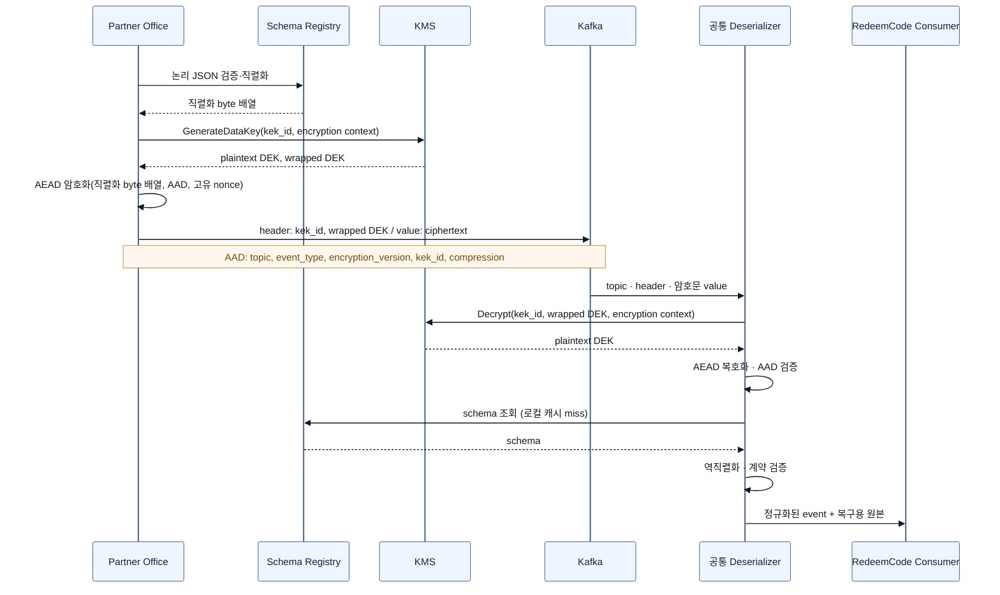
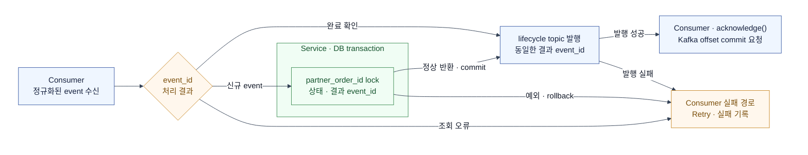

## TL;DR

과거에 했던 [**컬리몰 상품권 구매 프로세스 개선**](https://hyune-c.github.io/portfolio/kurlypay/02_kurlymall-giftcard-process/) 작업을 지금 한다면 어떤 점을 더 고려할까 생각해 봅니다.

- 발주·취소 전달의 주체를 RedeemCode의 2초 polling에서 Partner Office Kafka Producer로 바꿉니다.
- Consumer가 **at-least-once**로 재전달받아도 `event_id` 멱등성과 `partner_order_id` 상태 전이로 발급·취소 업무 흐름을 지킵니다.
- Kafka value 전체를 암호화하고, ciphertext와 복호화 metadata만 전달합니다.

## 기존 흐름 — 전자 상품권이 실물 상품의 발주 흐름을 따랐습니다


기존 흐름에는 크게 두 가지 문제가 있었습니다.

- **상시 부하**: 실물 상품 파트너들은 일 단위로 발주했지만, 상품권은 그 간극을 줄이기 위해 Partner Office API를 2초마다 조회했습니다. 처리할 주문이 없어도 요청은 계속 발생했습니다.
- **장애 취약성**: API나 Scheduler가 멈추면 발주·취소 전달이 늦어지고, 이는 고객 레벨의 장애로 이어집니다.

## 개선 흐름 — polling 대신 발주 event를 전달합니다


### 1. Partner Office에 전자 상품 발주 흐름을 추가합니다

Partner Office가 발주 대기 상태를 관리하고, RedeemCode Scheduler가 Polling 합니다.  
→ **Partner Office가 상품권 발주·취소 topic을 발행하고, 상태 변경 topic을 Consume하는 두 topic의 흐름을 추가합니다.**

| 용도 | Topic | Message type | Producer | Consumer | Kafka key |
| --- | --- | --- | --- | --- | --- |
| 상품권 발주·취소 | `redeem-code.order.v1` | `ORDER_REQUESTED`<br>`ORDER_CANCEL_REQUESTED` | Partner Office | 발주 Consumer | `partner_order_id` |
| 상품권 상태 변경 | `redeem-code.lifecycle.v1` | `ISSUE_SUCCEEDED`<br>`ISSUE_FAILED`<br>`USE_SUCCEEDED`<br>`CANCEL_SUCCEEDED`<br>`CANCEL_FAILED` | RedeemCode | Partner Office | `partner_order_id` |

발주와 취소는 같은 상품권의 순서가 중요하므로 하나의 order topic과 같은 key를 사용합니다. 처리 결과와 사용 상태는 흐름의 방향과 목적이 다르므로 lifecycle topic으로 분리합니다.

order event type은 `ORDER_REQUESTED`, `ORDER_CANCEL_REQUESTED`처럼 Partner Office에서 일어난 사실을 나타냅니다.  
lifecycle event type은 `ISSUE_SUCCEEDED`, `ISSUE_FAILED`처럼 `<행위>_<결과>` 형식으로 통일합니다.

### 2. 발주 단위와 이벤트 계약을 고정합니다

발주와 취소의 적용 시점이 Polling과 처리 지연의 영향을 받았습니다.  
→ **같은 `partner_order_id`를 Kafka key로 사용해, 한 상품권 발주의 event를 같은 흐름으로 처리합니다.**

두 식별자는 서로 다른 문제를 해결합니다.

- `partner_order_id`: 주문과 취소가 공유하는 상품권 한 건의 발주 단위이며 Kafka key로 사용합니다.
- `event_id`: event 전달을 식별하는 값입니다. 같은 event를 재전송할 때는 바꾸지 않습니다.

한 주문 항목에서 상품권을 N개 구매하면 Partner Office는 `partner_order_id`를 N개 만들고, 발주 요청 event도 N건 발행합니다.

```text
mall_order_id: order-100
└─ order_item_id: item-10 (상품권 3개)
   ├─ partner_order_id: partner-1 → 상품권 1개
   ├─ partner_order_id: partner-2 → 상품권 1개
   └─ partner_order_id: partner-3 → 상품권 1개
```

Kafka record의 envelope은 다음과 같으며, value 전체가 암호화됩니다.

```yaml
topic: redeem-code.order.v1
key: <partner_order_id>             # partition과 발주 단위
headers:
  event_type: ORDER_REQUESTED       # ORDER_REQUESTED | ORDER_CANCEL_REQUESTED
  encryption_version: e2ee-v1       # value 암·복호화 규약
  kek_id: <kms-key-arn>             # 복호화에 허용한 KMS key
  wrapped_dek: <binary>              # KMS key로 암호화한 DEK
  compression: none                 # 암호화 전 압축 방식
value: <nonce || ciphertext || authentication_tag> # nonce + 암호화 body + 변조 검증 tag
```

Schema Registry는 Kafka value를 만들기 전 JSON body 계약의 호환성을 관리합니다.

```json
{
  "event_id": "event-order-uuid",
  "event_type": "ORDER_REQUESTED",
  "mall_order_id": "mall-order-id",
  "order_item_id": "mall-order-item-id",
  "partner_order_id": "partner-order-id",
  "occurred_at": "2026-09-01T10:00:00Z",
  "product": {
    "partner_product_id": "partner-product-id",
    "quantity": 1
  },
  "recipient": {
    "name": "string",
    "phone_number": "string"
  }
}
```

취소는 같은 발주를 가리키되 새로운 요청 event로 만듭니다.

```json
{
  "event_id": "event-cancel-uuid",
  "event_type": "ORDER_CANCEL_REQUESTED",
  "mall_order_id": "mall-order-id",
  "order_item_id": "mall-order-item-id",
  "partner_order_id": "partner-order-id",
  "occurred_at": "2026-09-01T10:01:00Z",
  "cancel": {
    "reason": "CUSTOMER_REQUEST"
  }
}
```

- `mall_order_id`, `order_item_id`, `partner_order_id`, Kafka key는 주문과 취소에서 같습니다.
- `event_id`, `event_type`, `occurred_at`은 새 취소 요청 event에 맞게 바뀝니다.

같은 `partner_order_id`의 event는 같은 partition에 들어가므로 발주와 취소의 순서를 지킬 수 있습니다.

### 3. value 전체를 암호화합니다

Kafka로 전달하는 발주 event에는 개인정보가 들어갑니다.  
→ **발주 event의 value 전체를 DEK로 암호화하고, KMS로 감싼 `wrapped_dek`만 Kafka header에 전달합니다.**

발주 event는 충분히 작고 RedeemCode가 body 전체를 처리하므로, field별 처리보다 value 전체를 한 번에 암·복호화하는 편이 효율적입니다. 복호화 뒤에는 Kafka key와 body의 `partner_order_id`가 같은지 확인합니다.  
AEAD는 record 변조를, `event_id` 멱등성은 같은 암호문 record의 replay를 막습니다.



| 용어 | 역할 | Kafka record에서의 위치 |
| --- | --- | --- |
| KEK | DEK를 감싸고 푸는 KMS key | KMS 내부 |
| `kek_id` | 사용할 KEK의 식별자(key ARN) | header |
| encryption context | KMS가 DEK 복원을 허용할지 확인하는 조건 | KMS 호출 파라미터 |
| DEK | value를 암·복호화하는 record별 data key | Producer·공통 Deserializer 메모리 |
| `wrapped_dek` | KEK로 암호화한 DEK | header |
| AES-256-GCM (AEAD) | body를 암호화하고 변조를 검증하는 방식 | Producer·공통 Deserializer 처리 |
| AAD (Additional Authenticated Data) | 평문으로 두되 변조를 검증하는 metadata | topic·허용한 암호화 header로 재구성 |
| nonce | 매 암호화마다 달라야 하며, 복호화에도 필요한 공개 입력값 | 암호화된 binary value의 시작 바이트 |
| ciphertext | 암호화된 body | value |
| authentication tag (인증 tag) | ciphertext와 AAD의 변조를 검증하는 값 | 암호화된 binary value의 끝 바이트 |

### 4. 전송 중복과 업무 완료를 분리합니다

Kafka의 전송 중복과 RedeemCode의 업무 중복은 다른 문제입니다.  
→ **Producer 전송은 Kafka 설정으로 보호하고, 업무 완료는 DB 상태와 `event_id`로 확인합니다.**

`enable.idempotence=true`는 Producer 내부 Retry로 같은 record가 중복 저장되는 것을 막지만, 애플리케이션 재발행이나 업무 중복은 막지 못합니다.



`event_id`는 동일 event의 완료 여부를, `partner_order_id`는 동일 발주의 상태 전이를 보호하며, Service는 업무 상태와 결과 `event_id`를 같은 DB transaction에 저장합니다.  
DB commit 뒤 재전달되면 저장된 결과 `event_id`로 lifecycle event를 다시 발행하고, broker ack 뒤 Consumer offset을 ack합니다. Partner Office도 결과 `event_id`로 lifecycle event를 멱등 처리합니다.

#### 취소 가능 여부는 상품권 상태로 결정합니다

`ORDER_CANCEL_REQUESTED`는 취소 완료가 아닙니다. Partner Office가 lifecycle event로 먼저 확인하더라도, 최종 판단은 RedeemCode의 상태 전이가 결정합니다.

| 취소 시 상품권 상태 | 상태 전이 | 결과 event |
| --- | --- | --- |
| `ISSUED` | `CANCELLED`로 변경 | `CANCEL_SUCCEEDED` |
| `USED` | 상태 유지 | `CANCEL_FAILED` · `ALREADY_USED` |

### 5. Spring Cloud Stream으로 Consume 완료를 명시합니다

Kafka message 수신 성공만으로 RedeemCode의 업무 완료를 판단할 수 없습니다.  
→ **Spring Cloud Stream의 manual ack로 DB commit 또는 기존 처리 완료를 확인한 뒤 offset commit을 요청합니다.**  
**Kafka Binder**가 Consumer 함수와 topic·Consumer Group을 연결하고, **공통 메시징 모듈**은 value 정규화와 Retry를, **Service**는 DB transaction과 업무 멱등성을 담당합니다.

#### value 처리는 공통 Deserializer로 정규화합니다

`ErrorHandlingDeserializer`가 공통 `EnvelopeDeserializer`를 감쌉니다.  
**Envelope 검증 → KMS에서 DEK 복원 → 복호화 → 역직렬화·계약 검증**을 delegate에서 처리하므로 Consumer는 KMS나 암호화 형식을 알 필요 없이 정규화된 event를 받습니다.

- **공통 처리:** 허용한 KMS key·암호화 버전·schema를 검증하고, body와 header의 event type·발주 식별자가 일치하는지 확인합니다.
- **반환값:** `DecodedEnvelope<T>`에 업무 event와 원본 암호문·암호화 header를 함께 보관합니다. Consumer는 정규화된 event만 사용합니다.
- **오류 처리:** wrapper는 Consumer 호출 전에 발생한 복호화·역직렬화 오류와 원본 byte를 Container의 실패 경로로 전달합니다.

#### 성공은 ack, 실패는 Retry로 명시합니다

Kafka client의 주기적인 auto commit 대신, `MANUAL_IMMEDIATE`에서 Binder가 message header로 전달한 `Acknowledgment`를 호출해 offset commit을 요청합니다.  
Consumer는 DB commit 또는 기존 처리 완료를 확인한 뒤 ack합니다.

`consumeOrder-in-0`는 함수의 첫 번째 입력 Binding입니다.  
`stream.bindings`는 topic·Consumer Group 연결을, `stream.kafka.bindings`는 Kafka 전용 설정을 담당합니다.

```yaml
spring:
  cloud:
    function:
      definition: consumeOrder
    stream:
      bindings:
        consumeOrder-in-0:
          destination: redeem-code.order.v1
          group: redeem-code-order
          consumer:
            useNativeDecoding: true  # Kafka의 공통 Deserializer에 value 처리 위임
      kafka:
        bindings:
          consumeOrder-in-0:
            consumer:
              ackMode: MANUAL_IMMEDIATE
              configuration:
                enable.auto.commit: false
                max.poll.records: 5
                key.deserializer: org.apache.kafka.common.serialization.StringDeserializer
                value.deserializer: org.springframework.kafka.support.serializer.ErrorHandlingDeserializer
                spring.deserializer.value.delegate.class: com.example.messaging.EnvelopeDeserializer
```

```kotlin
@Bean
fun consumeOrder(): Consumer<Message<DecodedEnvelope<OrderEvent>>> = Consumer { message ->
    val ack = requireNotNull(
        message.headers.get(KafkaHeaders.ACKNOWLEDGMENT, Acknowledgment::class.java)
    )
    val event = message.payload.event // KMS·복호화·계약 검증을 마친 event

    // DB 반영 완료 또는 이미 처리한 결과를 반환
    val result = orderService.handle(event)

    // 재전달에도 DB에 저장한 동일한 결과 event_id를 사용
    lifecyclePublisher.publish(result)

    // 처리 예외가 발생하면 이 줄에 도달하지 않고 공통 Retry 경로로 전달
    ack.acknowledge() // 같은 Consumer 스레드에서 offset commit 요청
}
```

#### Retry를 소진하면 실패를 기록합니다

처리 실패는 Consumer에서 끝내지 않고 Retry 경로로 전달합니다.  
→ **최초 처리와 Retry 2회가 모두 실패하면 별도 transaction으로 실패를 기록하고 offset을 전진시킵니다.**

Binder의 `maxAttempts`만으로는 실패 기록과 복구 운영까지 제공되지 않습니다. 공통 모듈은 `ListenerContainerCustomizer`로 `DefaultErrorHandler`, Retry 2회, 오류 분류와 `commitRecovered=true`를 함께 설정합니다. `MANUAL_IMMEDIATE`에서 recovered offset을 전진시키려면 이 설정이 필요합니다.

- **업무 오류:** Consumer가 예외를 전달하면 Container가 Retry합니다.
- **Envelope·schema 오류:** 같은 입력으로 해결되지 않으므로 Retry 없이 실패 기록으로 보냅니다.
- **Retry 소진:** `ConsumerRecordRecoverer`가 별도 transaction으로 실패를 기록한 뒤 recovered offset을 commit합니다.
- **결과 발행 실패:** 이미 DB에 확정된 결과는 다시 발급하지 않습니다. failure record의 결과 `event_id`를 기준으로 lifecycle event만 재발행합니다.

실패 기록은 `(Consumer Group, topic, partition, offset)` unique 제약으로 중복을 막고 원본 ciphertext·header·오류 코드와, 결과가 이미 확정됐다면 결과 `event_id`를 보관합니다. 기록 후 offset commit 전에 종료되어도 재전달 시 기존 기록을 확인하고 offset을 전진시킬 수 있습니다.

#### partition 수가 처리 병렬성을 결정합니다

같은 Consumer Group에서 partition 하나는 Consumer 하나가 담당하며, Consumer 하나는 여러 partition을 맡을 수 있습니다.  
현재 event의 Retry가 끝날 때까지 offset은 전진하지 않고, 같은 partition의 다음 event도 Consumer 함수에 전달하지 않습니다.

- 같은 `partner_order_id`는 같은 partition에서 순서대로 처리합니다.
- Consumer 수가 partition 수보다 많아도 병렬성은 늘어나지 않습니다.
- 느린 event는 같은 partition의 다음 event를 지연시킵니다.

### 6. DLT는 복구 자동화 이후 도입합니다

실패 event가 늘거나 여러 Consumer의 복구를 한곳에서 운영해야 한다면 DLT를 검토합니다.  
→ **DLT 전송·알림·Replay가 모두 준비된 뒤 복구 인계 수단으로 사용합니다.**

DLT 전송 성공은 업무 성공이 아닙니다. 현재는 `enableDlq`를 켜지 않고 DB에 실패를 기록하며, 위 운영 계약과 Replay 도구가 준비되면 `redeem-code.order.v1.dlt`로 대체합니다.

| 조건 | 운영 계약 |
| --- | --- |
| DLT 전송 | 저장 성공을 확인한 뒤에만 원본 offset commit |
| 메시지 | 원본 `event_id`·key·ciphertext·암호화 header 유지 |
| Replay | 같은 `event_id`·`partner_order_id`로 다시 처리 |
| DLT 전송 실패 | 원본 offset 유지·partition pause·운영자 호출 |

## 참고

- [**컬리몰 상품권 구매 프로세스 개선**](https://hyune-c.github.io/portfolio/kurlypay/02_kurlymall-giftcard-process/) — 기존 polling 흐름과 이번 재설계의 비교 기준.
- [초당 100만 건, LINE 앱에 Apache Kafka 종단 간 암호화 적용기](https://techblog.lycorp.co.jp/ko/applying-e2ee-to-apache-kafka-in-line-app) — record 단위 payload 암호화와 DEK·KEK envelope, 직렬화 경계.
- [Schema Formats for Schema Registry on Confluent Platform](https://docs.confluent.io/platform/current/schema-registry/fundamentals/serdes-develop/overview.html#wire-format) — schema-aware 직렬화·역직렬화가 암·복호화 전후에 놓이는 경계.
- [Producer Configs](https://kafka.apache.org/40/configuration/producer-configs/) — `enable.idempotence`, Retry, in-flight 요청 설정.
- [Message Delivery Semantics](https://kafka.apache.org/42/design/design/#message-delivery-semantics) — at-least-once 전달과 Consumer 멱등 처리의 전제.
- [KafkaConsumer (clients 4.1.2 API)](https://kafka.apache.org/41/javadoc/org/apache/kafka/clients/consumer/KafkaConsumer.html) — 읽기·commit 위치와 파티션 할당.
- [Manual Acknowledgement](https://docs.spring.io/spring-cloud-stream/reference/kafka/kafka-binder/manual-ack.html) · [Configuration Options](https://docs.spring.io/spring-cloud-stream/reference/kafka/kafka-binder/config-options.html) — Consumer·Binding과 명시적 완료 처리.
- [Deserializer (clients 4.1.2 API)](https://kafka.apache.org/41/javadoc/org/apache/kafka/common/serialization/Deserializer.html) · [Serialization, Deserialization, and Message Conversion](https://docs.spring.io/spring-kafka/reference/kafka/serdes.html#using-errorhandlingdeserializer) — 공통 value 처리의 입력·실패 경계와 원본 보존.
- [Spring Cloud Stream 도입하기](https://tech.kakaopay.com/post/spring-cloud-stream/) · [Kafka Binder Listener Container Customizers](https://docs.spring.io/spring-cloud-stream/reference/kafka/kafka-binder/container-cust-kafka-binder.html) · [Retry and Dead Letter Processing](https://docs.spring.io/spring-cloud-stream/reference/kafka/kafka-binder/retry-dlq.html) — 메시징 추상화와 Container Retry 확장 지점.
