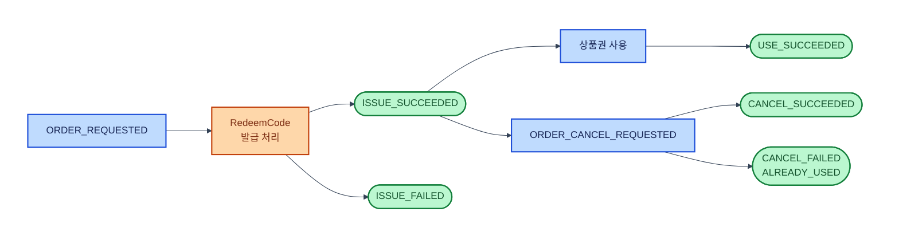
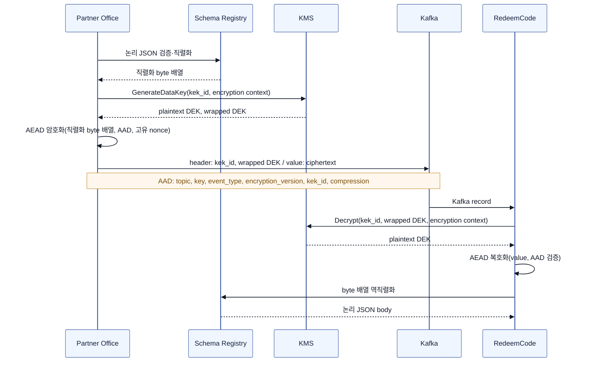

## TL;DR

과거에 했던 [**컬리몰 상품권 구매 프로세스 개선**](https://hyune-c.github.io/portfolio/kurlypay/02_kurlymall-giftcard-process/) 작업을 지금 한다면 어떤 점을 더 고려할까 생각해 봅니다.

- 발주·취소 전달의 주체를 RedeemCode의 2초 polling에서 Partner Office Kafka Producer로 바꿉니다.
- Consumer가 **at-least-once**로 재전달받아도 `event_id` 멱등성과 `partner_order_id` 상태 전이로 발급·취소 업무 흐름을 지킵니다.
- Kafka value 전체를 암호화하고, ciphertext와 복호화 metadata만 전달합니다.

## 기존 흐름 — 전자 상품권이 실물 상품의 발주 흐름을 따랐습니다


기존 흐름에는 크게 두 가지 문제가 있었습니다.

- **상시 부하**: 실물 상품 파트너들은 일 단위로 발주했지만, 상품권은 빠른 전달을 위해 Partner Office API를 2초마다 조회했습니다. 처리할 주문이 없어도 요청은 계속 발생했습니다.
- **장애 취약성**: API나 Scheduler가 멈추면 발주·취소 전달이 늦어지고, 이는 고객 레벨의 장애로 이어집니다.

## 개선 흐름 — polling 대신 발주 event를 전달합니다


### 1. Partner Office에 전자 상품 발주 흐름을 추가합니다

Partner Office가 발주 대기 상태를 관리하고, RedeemCode Scheduler가 Polling 합니다.  
→ **Partner Office가 상품권 발주·취소 topic을 발행하고, 상태 변경 topic을 소비하는 두 topic의 흐름을 추가합니다.**

| 용도 | Topic | Message type | Producer | Consumer | Kafka key |
| --- | --- | --- | --- | --- | --- |
| 상품권 발주·취소 | `redeem-code.order.v1` | `ORDER_REQUESTED`<br>`ORDER_CANCEL_REQUESTED` | Partner Office | 발주 Consumer | `partner_order_id` |
| 상품권 상태 변경 | `redeem-code.lifecycle.v1` | `ISSUE_SUCCEEDED`<br>`ISSUE_FAILED`<br>`USE_SUCCEEDED`<br>`CANCEL_SUCCEEDED`<br>`CANCEL_FAILED` | RedeemCode | Partner Office | `partner_order_id` |

발주와 취소는 같은 상품권의 순서가 중요하므로 하나의 order topic과 같은 key를 사용합니다. 처리 결과와 사용 상태는 흐름의 방향과 목적이 다르므로 lifecycle topic으로 분리합니다.

order event type은 `ORDER_REQUESTED`, `ORDER_CANCEL_REQUESTED`처럼 Partner Office에서 일어난 사실을 나타냅니다. lifecycle event type은 `ISSUE_SUCCEEDED`, `ISSUE_FAILED`처럼 `<행위>_<결과>` 형식으로 통일합니다.

### 2. 발주 단위와 이벤트 계약을 고정합니다

발주와 취소의 적용 시점이 Polling과 처리 지연의 영향을 받았습니다.  
→ **같은 `partner_order_id`를 Kafka key로 사용해, 한 상품권 발주의 event를 같은 흐름으로 처리합니다.**

두 식별자는 서로 다른 문제를 해결합니다.

- `partner_order_id`: 주문과 취소가 공유하는 상품권 한 건의 발주 단위이며 Kafka key로 사용합니다.
- `event_id`: event 전달을 식별하는 값입니다. 같은 event를 재전송할 때는 바꾸지 않습니다.

한 주문 항목에서 상품권을 N개 구매하면 Partner Office는 `partner_order_id`를 N개 만들고, 발주 요청 event도 N건 발행합니다.

```text
mall_order_id: order-100
└─ order_item_id: item-10 (상품권 3개)
   ├─ partner_order_id: partner-1 → 상품권 1개
   ├─ partner_order_id: partner-2 → 상품권 1개
   └─ partner_order_id: partner-3 → 상품권 1개
```

Kafka record의 envelope은 다음과 같으며, value 전체가 암호화됩니다.

```yaml
topic: redeem-code.order.v1
key: <partner_order_id>             # partition과 발주 단위
headers:
  event_type: ORDER_REQUESTED       # ORDER_REQUESTED | ORDER_CANCEL_REQUESTED
  encryption_version: e2ee-v1       # value 암·복호화 규약
  kek_id: <kms-key-arn>             # 복호화에 허용한 KMS key
  wrapped_dek: <binary>              # KMS key로 암호화한 DEK
  compression: none                 # 암호화 전 압축 방식
value: <nonce || ciphertext || authentication_tag> # nonce + 암호화 body + 변조 검증 tag
```

Schema Registry는 Kafka value를 만들기 전 JSON body 계약의 호환성을 관리합니다.

```json
{
  "event_id": "event-order-uuid",
  "event_type": "ORDER_REQUESTED",
  "mall_order_id": "mall-order-id",
  "order_item_id": "mall-order-item-id",
  "partner_order_id": "partner-order-id",
  "occurred_at": "2026-09-01T10:00:00Z",
  "product": {
    "partner_product_id": "partner-product-id",
    "quantity": 1
  },
  "recipient": {
    "name": "string",
    "phone_number": "string"
  }
}
```

취소는 같은 발주를 가리키되 새로운 요청 event로 만듭니다.

```json
{
  "event_id": "event-cancel-uuid",
  "event_type": "ORDER_CANCEL_REQUESTED",
  "mall_order_id": "mall-order-id",
  "order_item_id": "mall-order-item-id",
  "partner_order_id": "partner-order-id",
  "occurred_at": "2026-09-01T10:01:00Z",
  "cancel": {
    "reason": "CUSTOMER_REQUEST"
  }
}
```

- `mall_order_id`, `order_item_id`, `partner_order_id`, Kafka key는 주문과 취소에서 같습니다.
- `event_id`, `event_type`, `occurred_at`은 새 취소 요청 event에 맞게 바뀝니다.

### 3. 상태 전이로 취소 가능 여부를 결정합니다

상품권 사용 뒤에도 주문 취소 요청이 들어올 수 있습니다.  
→ **RedeemCode가 현재 상태 전이로 취소 가능 여부를 판단합니다.**

`ORDER_CANCEL_REQUESTED`는 취소 완료가 아닙니다. RedeemCode가 상품권별 상태 전이를 적용한 뒤에만 취소 가능 여부를 확정합니다.



Partner Office는 허용된 lifecycle event만 반영해 이미 사용된 상품권의 주문 취소를 빠르게 차단합니다. 취소 완료는 RedeemCode가 `ISSUED → CANCELLED` 전이에 성공한 뒤에만 확정합니다. 이미 `USED`라면 상태를 바꾸지 않고 `CANCEL_FAILED` event와 `ALREADY_USED` 사유를 발행합니다.

### 4. Kafka 설정만으로 업무 멱등성은 완성되지 않습니다

API 조회 결과와 Scheduler 처리 위치에 복구 기준이 나뉘었습니다.  
→ **Producer 중복 방지 설정과 Consumer의 이벤트 수신 이력을 함께 적용하고, 수신 이력과 발주 상태를 한 transaction으로 기록합니다.**

#### Producer 전송 보장 (idempotence)

Producer의 `enable.idempotence=true`는 전송 재시도로 같은 record가 Kafka에 두 번 기록되지 않게 합니다.  
`acks=all`, 재시도 허용(`retries>0`), `max.in.flight.requests.per.connection≤5`가 필요합니다.  
재시도 시간의 상한은 `retries`보다 `delivery.timeout.ms`로 관리합니다.

하지만 이 설정만으로 RedeemCode의 발급 처리를 **exactly-once**로 보장하지는 않습니다.  
Consumer는 DB 반영 후 offset commit 전에 종료될 수 있으므로, **at-least-once 전달을 전제로** 같은 event를 다시 처리할 수 있어야 합니다.

#### Consumer 업무 멱등성 (at-least-once → 중복 발급 방지)

`event_id` 수신 이력과 발주 상태 변경을 하나의 transaction으로 기록합니다.  
같은 `event_id`가 다시 오면 새 상태를 만들지 않고, 이전 결과 event를 다시 발행할 수 있습니다. 결과 event 자체는 at-least-once로 중복 전달될 수 있습니다.

`partner_order_id`는 어느 상품권 lifecycle을 바꿀지 찾는 business key입니다.  
다른 `event_id`가 와도 현재 상태에서 허용되는 전이인지 판단하고, 발급 결과 unique 제약으로 한 번 더 막습니다.

#### DLT와 partition

DLT 재처리도 원래 `event_id`와 `partner_order_id`를 유지하고, 현재 상태에서 유효한 전이인지 다시 확인합니다.  
늦게 돌아온 `ORDER_REQUESTED`는 이미 반영된 취소를 되살리지 못합니다.

`partner_order_id`는 발주 lifecycle을 같은 partition에 모으고 상태 전이 대상을 찾는 key입니다.  
Producer 설정은 전송 중복을 줄이고, 실제 업무 멱등성은 Consumer가 완성합니다.

### 5. value 전체를 암호화합니다

Kafka로 전달하는 발주 event에는 개인정보가 들어갑니다.  
→ **발주 event의 value 전체를 DEK로 암호화하고, KMS로 감싼 `wrapped_dek`만 Kafka header에 전달합니다.**

발주 event는 충분히 작고 RedeemCode가 body 전체를 처리하므로, field별 처리보다 value 전체를 한 번에 암·복호화하는 편이 효율적입니다.



| 용어 | 역할 | Kafka record에서의 위치 |
| --- | --- | --- |
| KEK | DEK를 감싸고 푸는 KMS key | KMS 내부 |
| `kek_id` | 사용할 KEK의 식별자(key ARN) | header |
| encryption context | KMS가 DEK 복원을 허용할지 확인하는 조건 | KMS 호출 파라미터 |
| DEK | value를 암·복호화하는 record별 data key | Producer·Consumer 처리 중 |
| `wrapped_dek` | KEK로 암호화한 DEK | header |
| AES-256-GCM (AEAD) | body를 암호화하고 변조를 검증하는 방식 | Producer·Consumer 처리 |
| AAD (Additional Authenticated Data) | 평문으로 두되 변조를 검증하는 metadata | topic, key, header에서 재구성 |
| nonce | 매 암호화마다 달라야 하며, 복호화에도 필요한 공개 입력값 | 암호화된 binary value의 시작 바이트 |
| ciphertext | 암호화된 body | value |
| authentication tag (인증 tag) | ciphertext와 AAD의 변조를 검증하는 값 | 암호화된 binary value의 끝 바이트 |

## 참고

- [**컬리몰 상품권 구매 프로세스 개선**](https://hyune-c.github.io/portfolio/kurlypay/02_kurlymall-giftcard-process/) — 기존 polling 흐름과 이번 재설계의 비교 기준.
- [초당 100만 건, LINE 앱에 Apache Kafka 종단 간 암호화 적용기](https://techblog.lycorp.co.jp/ko/applying-e2ee-to-apache-kafka-in-line-app) — record 단위 payload 암호화와 DEK·KEK envelope, 직렬화 경계.
- [AsyncAPI Specification 3.0.0](https://www.asyncapi.com/docs/reference/specification/v3.0.0) — event 계약을 topic·message·payload로 표현하는 방식.
- [AsyncAPI Kafka bindings](https://github.com/asyncapi/bindings/blob/master/kafka/README.md) — Kafka channel과 message binding의 표현 방식.
- [Confluent Schema Registry wire format](https://docs.confluent.io/platform/current/schema-registry/fundamentals/serdes-develop/overview.html#wire-format) — schema-aware 직렬화·역직렬화가 암·복호화 전후에 놓이는 경계.
- [Apache Kafka Producer Configs](https://kafka.apache.org/40/configuration/producer-configs/) — `enable.idempotence`, 재시도, in-flight 요청 설정.
- [Apache Kafka Design — Message Delivery Semantics](https://kafka.apache.org/42/design/design/) — at-least-once 전달과 Consumer 멱등 처리의 전제.
- [Kafka 메시지 전달 보장](https://curiousjinan.tistory.com/entry/kafka-message-delivery-guarantees) — at-most-once·at-least-once·exactly-once 전달 보장 개념 정리.
- [Apache Kafka Isn’t a Silver Bullet: 4 Things to Check Before You Ship](https://medium.com/greglee-lab/apache-kafka-isnt-a-silver-bullet-4-things-to-check-before-you-ship-28128627a32f) — Kafka 도입 전 운영 위험을 점검하는 관점.
- [The 8 Core Concepts That Make Up Apache Kafka](https://medium.com/greglee-lab/the-8-core-concepts-that-make-up-apache-kafka-adfe5c57fc0f) — topic·partition·consumer group 개념 정리.
- [“Kafka 써봤어요”라는 후보자에게 질문할 것들](https://medium.com/greglee-lab/kafka-%EC%8D%A8%EB%B4%A4%EC%96%B4%EC%9A%94-%EB%9D%BC%EB%8A%94-%ED%9B%84%EB%B3%B4%EC%9E%90%EC%97%90%EA%B2%8C-%EC%A7%88%EB%AC%B8%ED%95%A0-%EA%B2%83%EB%93%A4-913d7890eb28) — Producer·Consumer 운영 점검 관점.
