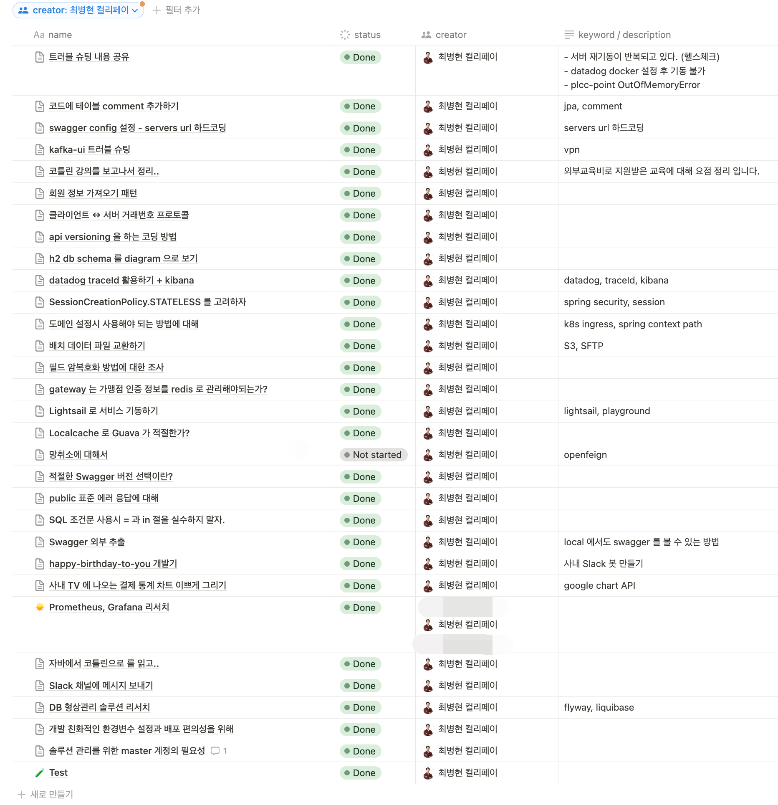
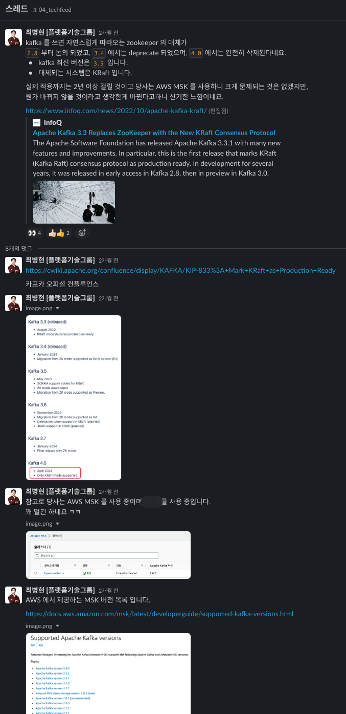
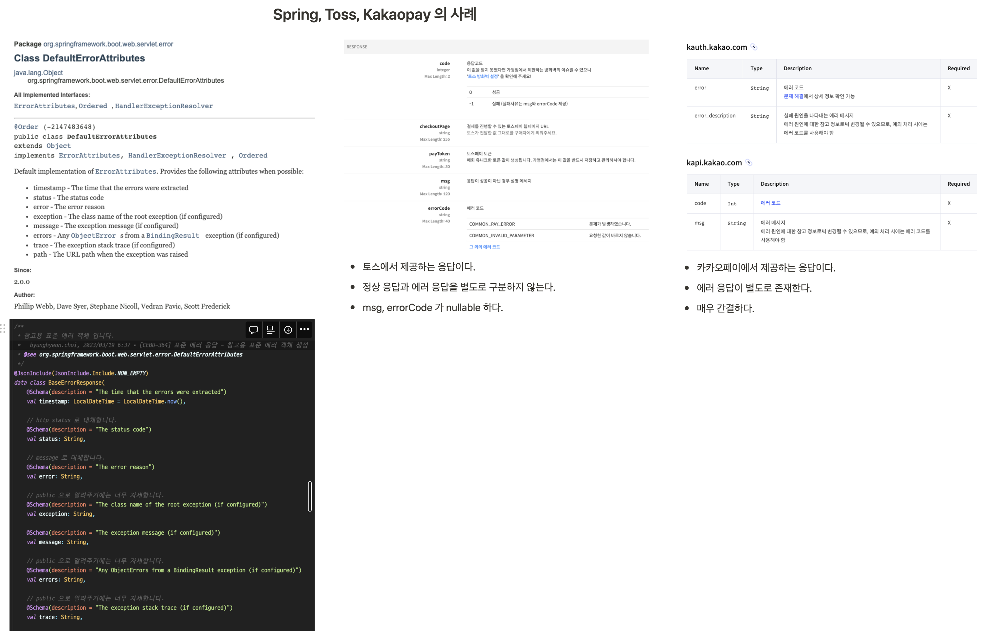

Writing good code is only part of the job. What makes a team consistently fast is clear communication, shared knowledge, and habits that compound over time.

## Making Problems Explicit

When multiple workstreams are in flight, I document the flow before dividing the work. Writing down decision points, owners, and acceptance criteria means whoever picks up a task can act immediately — no synchronization meeting needed.

Even verbal agreements go back into writing so the context travels with the work.

<figure class="grid-cap">

*Mapping the problem flow and decision points before splitting work.*

</figure>

<figure class="grid-cap">

*Each delegated task includes owner, goal, and verification criteria — so the recipient can act immediately.*

</figure>

After the work is done, I record what was decided and why — so the team doesn't re-derive the same analysis next time.

## Sharing Knowledge Across the Team

Individual expertise that stays in one person's head is a liability. I've built internal wikis, run tech talks, and structured knowledge-sharing sessions so what one person knows becomes something the whole team can draw on — especially during onboarding and incidents.

<figure class="grid-cap">

*An internal wiki covering recurring topics: gift cards, settlement, and incident response.*

</figure>

<figure class="grid-cap">

*Tech talks structured to leave reusable reference material, not just the talk itself.*

</figure>

## Closing the Loop Between Learning and Code

I treat learning as a pipeline: study a topic → validate it in a side project → apply it to production. Recurring topics — Kotlin, Spring, testing, external integrations — get organized into personal templates ready to pull from directly.

Code review and mentoring extend this further: I surface recurring issues as learning topics, then close the loop in onboarding and future reviews.

One concrete example: I defined a standard Error DTO to prevent response format drift across services. Rather than just documenting the format, I aligned the exception-handling flow with the API response spec — reducing debugging cost and client integration friction.

<figure class="grid-cap">

*Code review against explainable criteria, with recurring issues turned into learning topics.*

</figure>

<figure class="grid-cap">

*A standard Error DTO aligning exception handling with the API response spec.*

</figure>

