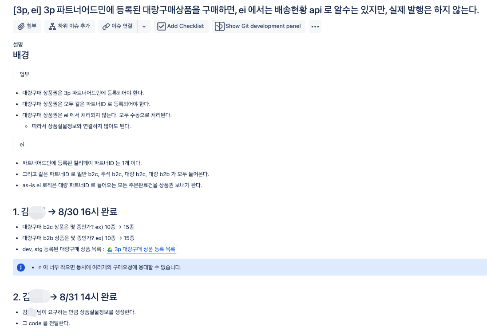
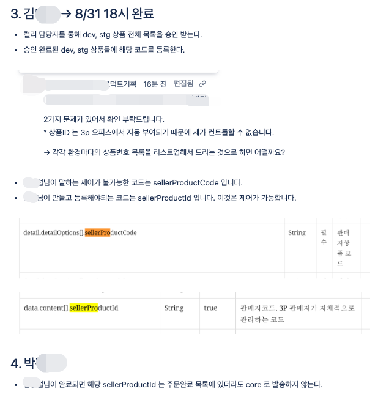
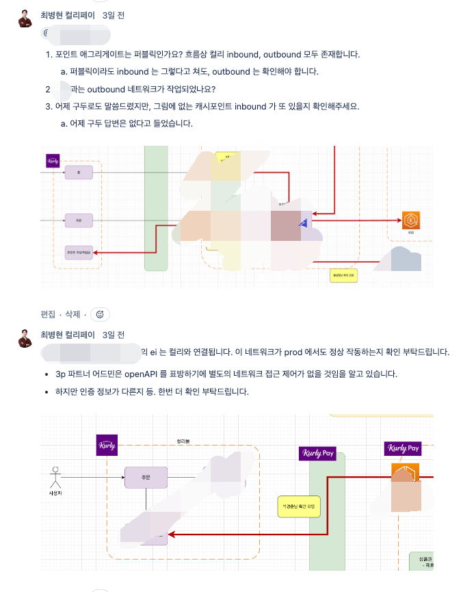
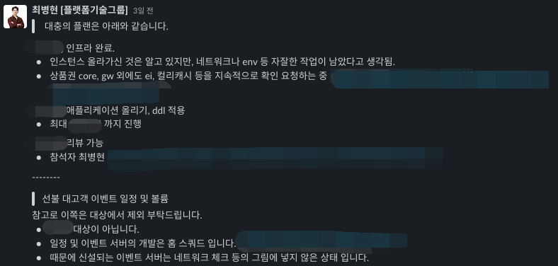

To speed up a team's work, I believe you first have to lay out the problem explicitly.  
By mapping the flow and writing down the direction and deadline for any work that needs to be split off, you can cut down on omissions and delays.

## Analyzing the Problem and Mapping the Flow

When several things are in progress at once, I started by documenting the flow of the problem and its decision points.  
I put what we'd agreed on verbally back into writing, so that whoever picked up the work next could move with the same context.

*A documented map of the problem flow and its decision points.*

*Verbal agreements written back down so the next person shares the context.*

## Splitting Up Work and Delegating

For work that could run in parallel, I handed it off with the owner, the goal, and the way to verify it kept separate and clear.  
Delegation isn't about passing off a task—it's the process of making the problem small enough that the other person can act on it right away, and handing over the context along with it.

*Parallel work handed off with owner, goal, and verification kept clear.*

*A task broken down small enough to act on, with its context attached.*

## Recording What Was Done and Following Up

Even after the work was finished, I left a record of the decisions made and the follow-up actions, so the team wouldn't have to repeat the same analysis the next time a similar problem came up.

*A record of the decisions made once the work was finished.*

*Follow-up actions noted so the team avoids repeating the analysis.*

