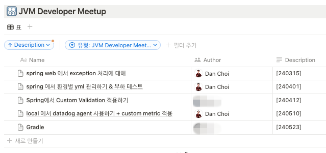
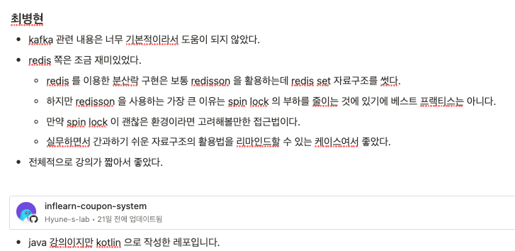

A good developer isn't just someone who does well on their own—it's someone who builds a foundation that lets their colleagues understand faster and act more safely.

Through an internal wiki, tech sharing, and training sessions, I tried to turn what individuals knew into a team asset.

## Running Wrtn's Internal Tech Meetup

- I ran a Tech Meetup to build a culture of sharing technical knowledge across the company
- I organized the talk topics and examples into a standardized format, so that the docs and samples could be referenced again even after the talk

*Wrtn's internal Tech Meetup building a company-wide knowledge-sharing culture.*

*Talk topics organized into a standardized, reusable format.*

*Docs and samples kept referenceable after the talk ended.*

## KurlyPay Internal Wiki

At KurlyPay, I organized the knowledge we needed repeatedly—gift certificates, settlement, operations, incident response, and more—into an internal wiki. I wrote a total of 31 documents so they could be used for onboarding new hires and for operational response.

*KurlyPay internal wiki of 31 docs for onboarding and operations.*

## Internal Sharing

I shared what I'd learned from external training across the company, organized in a form that could be applied directly to the work. With tech sharing, I focused less on the talk itself and more on leaving a record that could be drawn on again later when making decisions on the job.

*External training takeaways shared company-wide in an applicable form.*

*A record left to draw on later when making decisions on the job.*

*A tech-sharing session turning individual knowledge into a team asset.*

*Material organized so it can be referenced again in future work.*

