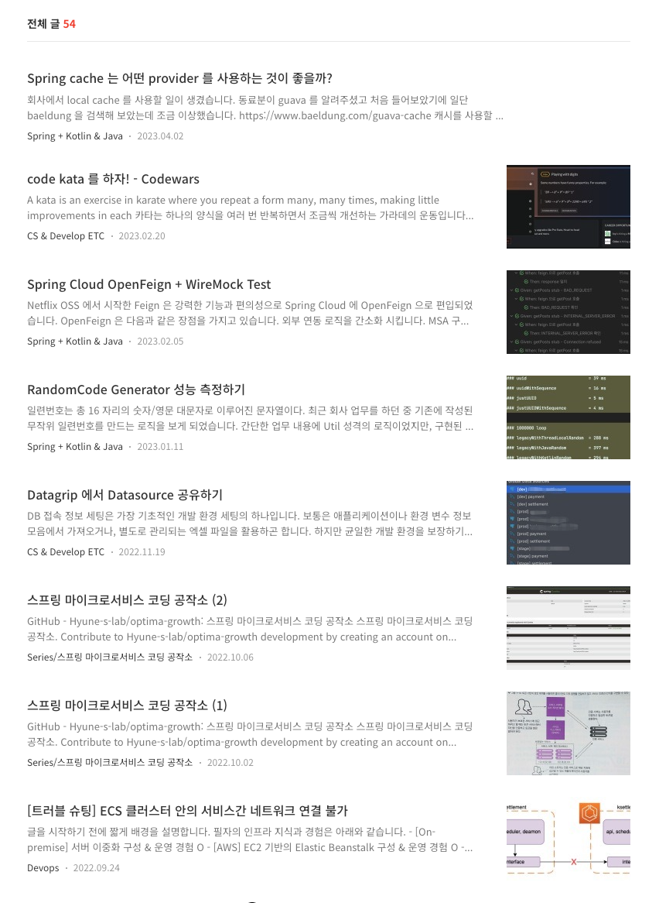
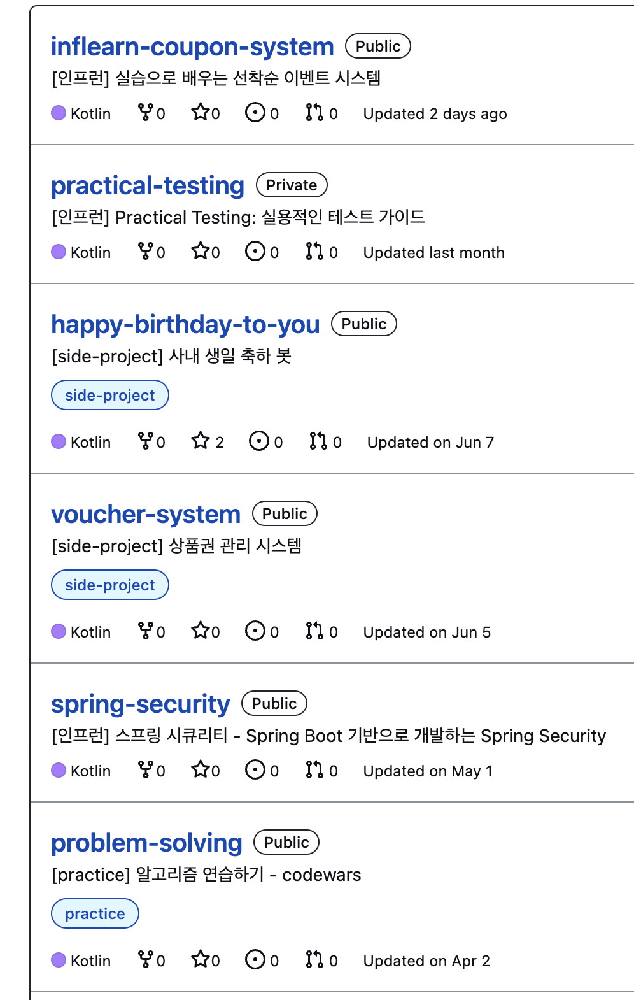
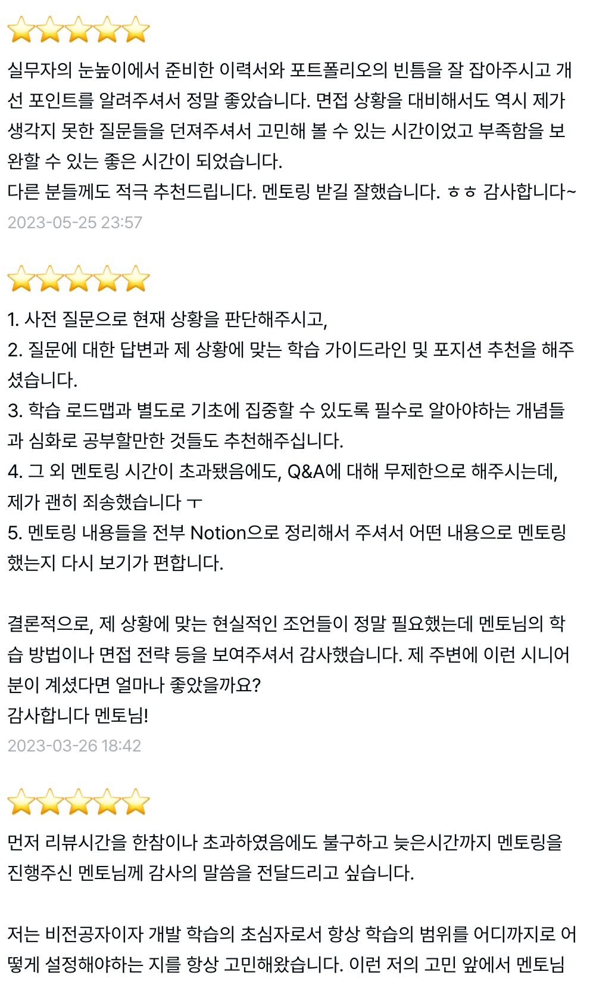
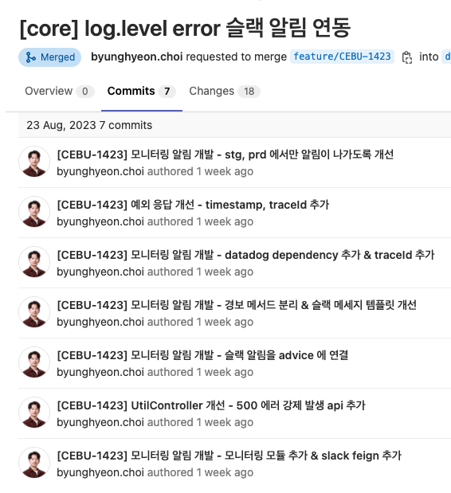
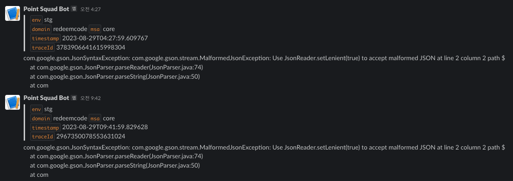

Rather than letting personal learning end as just studying, I distilled it into patterns and tools I could reuse on the job.

Through blogging, RSS, side projects, code review, and mentoring, I recorded and validated what I learned, then connected it back to real work.

## RSS, Blogging, and Learning

- Through RSS subscriptions and writing blog posts, I steadily organized the topics I needed for work
- I captured topics I run into repeatedly on the job—Kotlin, Spring, testing, architecture, external integrations—in personal repositories and posts
- I organized them as examples and templates so I could pull them out and use them right when I needed them

*RSS subscriptions used to steadily organize work-relevant topics.*

*Blog posts capturing recurring topics like Kotlin, Spring, and testing.*

*Learning organized as examples and templates ready to reuse.*

## Code Review and Mentoring

- Through code reviewing and mentoring, I read other people's code against criteria I could explain, and gave feedback on it
- I took problems that recurred during reviews and reorganized them into personal learning topics, then put them to use later in real code reviews and onboarding

*Reading others' code against explainable criteria and giving feedback.*

*Mentoring that turned recurring review issues into learning topics.*

## Applying It at Work

I kept a separate record of cases where I applied what I'd learned to real work. I prefer to experiment small in a personal project first, then trim or adapt it to fit the company codebase.

### Slack Integration Pattern

I applied the Slack integration pattern I'd used in a birthday-celebration bot to alerting and operational automation at work.
I first validated the API usage and message structure in a small side project, then reused it adapted to the company environment.

*Slack integration first validated in a birthday-celebration bot side project.*

*The same pattern reused for alerting in the company environment.*

*Slack integration applied to operational automation at work.*

### Standard Error DTO

To keep the error response format from drifting between services, I defined a standard Error DTO.
This was more than just documentation—I designed it so that the exception-handling flow and the API response spec lined up together, cutting down the cost of debugging and client integration.

*A standard Error DTO keeping the response format consistent across services.*

*Exception-handling flow lined up with the API response spec.*

*Design that cuts the cost of debugging and client integration.*

### Other Applied Cases

- Guided how to use AWS Transfer Family for exchanging files with external parties
- Studied Kafka-based event sourcing, CQRS, and compaction object design, and reflected them in work design
- Organized OpenFeign's retryer, errorDecoder, and WireMock testing patterns to improve the stability of external integrations
- Built convenience methods for coroutine-based concurrency testing to reduce the cost of repeated verification

## Side Projects

- [Hyune-s-lab](https://github.com/orgs/Hyune-s-lab/repositories) — an organization gathering various study materials and experimental projects
- [kotlin-workshop](https://github.com/Hyune-s-lab/kopring-workshop) — a project that templatizes commonly used functionality
- [url-shortener](https://github.com/Hyune-s-lab/url-shortener) — a hexagonal-architecture-based project structured so the implementation can be swapped out as requirements change
- [Our Class Bank](https://github.com/Our-Class-Bank/core-backend) — an allowance- and credit-score-management program, actually used by 1 teacher and 26 elementary school students
