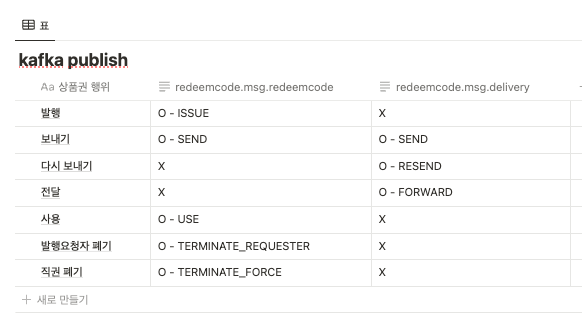

## 배경

상품권은 외부 제휴사 흐름과 컬리몰 흐름이 섞여 있어, 단일 구조로 처리하기 어려웠습니다.  
B2C 주문과 B2B 구매, 법인카드/개인 대량 구매 등 유스케이스가 다양해 각각의 설계와 운영 기준이 필요했습니다.

## 성과

- 외부 제휴사 B2B, 컬리몰 B2C, 법인카드, 개인 대량 구매 4종 유스케이스 지원
- 외부 제휴사용 gateway / core 서버 분리로 흐름·책임 경계 명확화
- 상품권 라이프사이클 Kafka 처리 설계로 비동기 흐름 일관성 확보

## 상세

상품권 설계/개발/운영을 담당하며 기획 자료 조사, 제휴사/컬리/외주 파트너사 커뮤니케이션까지 함께 수행했습니다.

- 계약/상품 관계와 상품권 발행 흐름 개발
- 외부 제휴사용 gateway / core 서버 분리, B2C 컬리몰 주문과 B2B 구매 흐름 분리 설계
- 상품권 라이프사이클 Kafka 처리 설계

