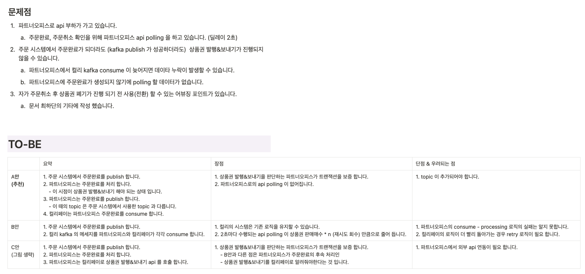
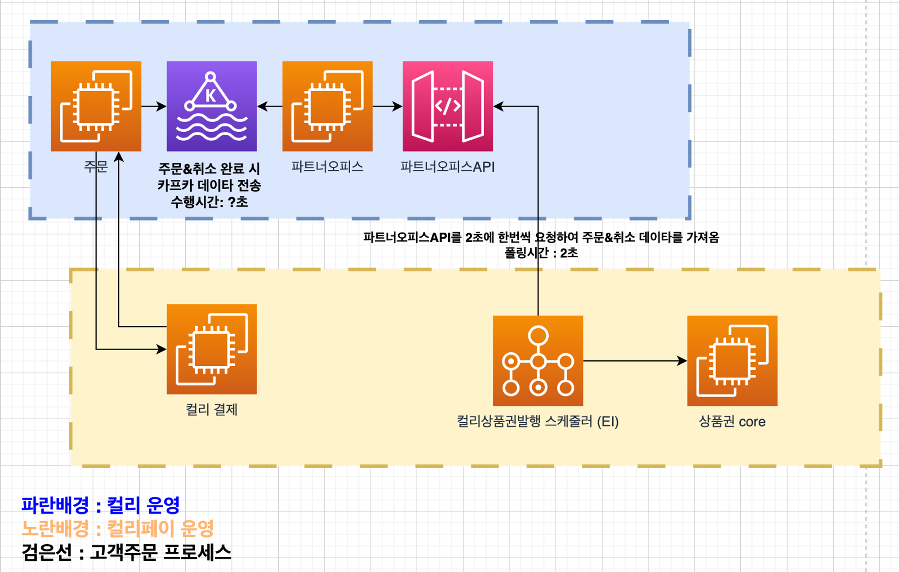
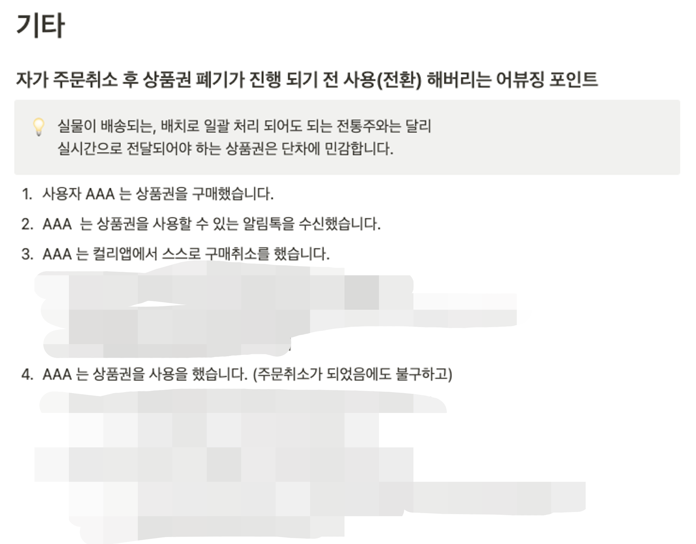

## Background

After launch, any failure caused data inconsistencies between Kurly and Kurly Pay, requiring operators to respond manually.  
With the legacy Go logic and the new Kotlin/Spring flow coexisting, we needed a way to connect the two flows while restoring consistency.

## Outcomes

- Redesigned the structure into Kafka-based eventual consistency capable of self-recovering during failures
- Established a foundation for gradual migration while running the Go legacy and the new Kotlin/Spring flow simultaneously

## Details

**Problem analysis and TO-BE design**

*Summary of the failure-driven inconsistency problem and the TO-BE design.*

**Architecture change**

**AS-IS (polling-based)**

**TO-BE (Kafka event-based)**

<figure class="grid-cap">

*AS-IS polling-based architecture between Kurly and Kurly Pay.*

</figure>

<figure class="grid-cap">

*TO-BE Kafka event-based architecture enabling eventual consistency.*

</figure>

**Other operational considerations**

<figure class="grid-cap">

*Analysis of abuse scenarios considered during the redesign.*

</figure>

<figure class="grid-cap">

*Wiki structure documenting the 3P Partner Office integration.*

</figure>

