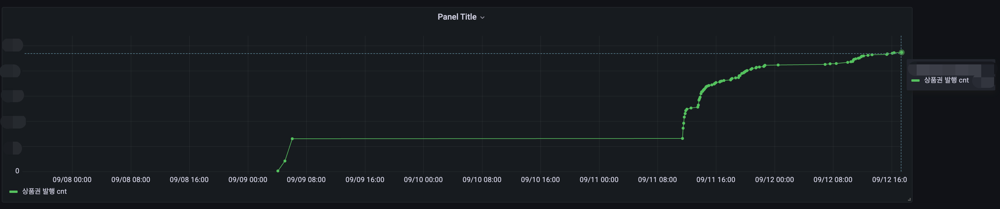
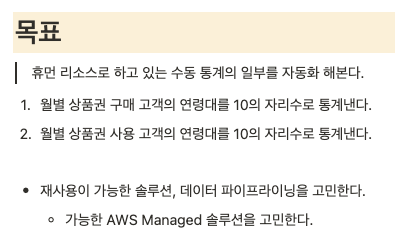

## Background

For non-developers (operations/planning) to check key metrics, they had to request them from developers every time.  
A dashboard that enabled quick checks was needed, and I later considered a statistics structure that went beyond simple query sharing.

## Outcomes

- Enabled non-developers to check key metrics directly through Redash-based dashboards
- Organized the queries and lookup flows frequently used by operations/planning
- Researched a scalable statistics architecture considering the data model, aggregation methods, query performance, and operational convenience

## Details

**Redash-based monitoring setup**

*Redash chart showing payment method breakdown and share.*

<figure class="grid-cap">

*Redash dashboard of basic gift card statistics for operations.*

</figure>

<figure class="grid-cap">

*Time-series graph tracking gift card issuance over time.*

</figure>

**Research into scalable data statistics**

After operating Redash, I researched a statistics architecture that went beyond simple query sharing to jointly consider the data model, aggregation methods, query performance, and operational convenience.

<figure class="grid-cap">

*Background discussion summarizing the existing query-sharing approach.*

</figure>

<figure class="grid-cap">

*Goal definition for the statistics to be automated.*

</figure>

<figure class="grid-cap">

*Plan studying ETL/ELT and AWS Pipeline for scalable statistics.*

</figure>

