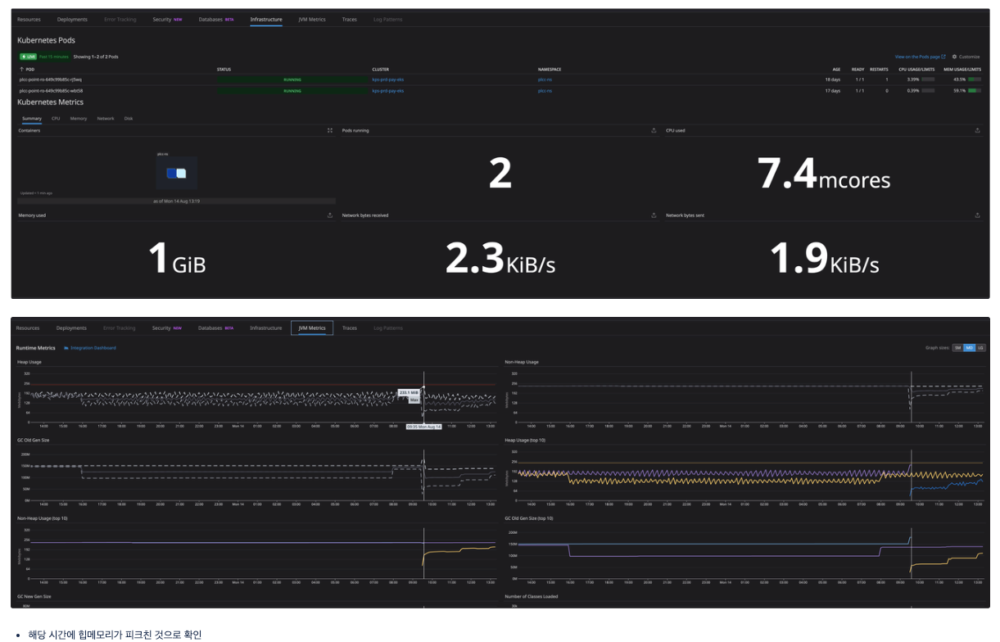
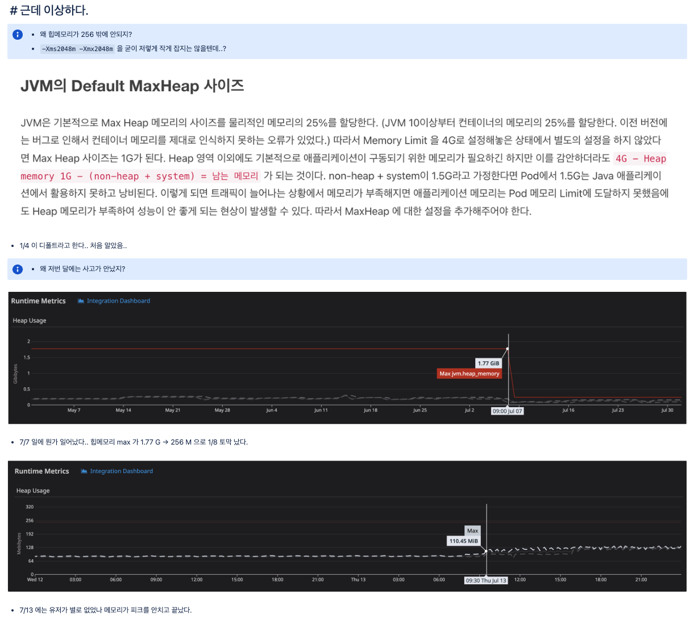

## 이슈 상황

- 담당자가 퇴사한 상태에서 배치 작업 중 OutOfMemoryError 가 발생했습니다
- 메모리 사용량이 증가하는 구간을 분석해 단기 완화 방법을 제시했고, 이후 전사 메모리 최적화 작업까지 이어갔습니다

## 분석

이슈 리포트를 받아 OOM 에러 로그를 확인하고, 해당 시간대에 메모리가 피크로 올라간 것을 확인했습니다.

단순한 OOM 이슈로 끝내지 않고 한 단계 더 들어가, JVM 메모리 설정 자체가 잘못되어 있는 것을 발견했습니다.

## 개선

Dockerfile 의 JVM 메모리 옵션을 개선하고, 동일한 패턴이 적용될 수 있도록 전사에 전파했습니다.

인프라 작업 후 재처리 시 메모리가 553MB 까지 안정적으로 동작하는 것을 확인했습니다.

