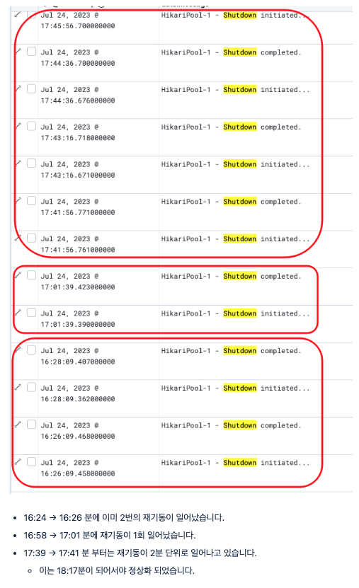
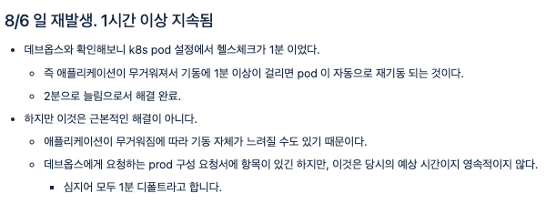

## 이슈 상황

- 배포 후 인스턴스가 간헐적으로 정상 기동되지 않는 현상이 발생했습니다
- 확인 결과 health check 간격이 1분으로 너무 짧아, 최초 기동 중 간헐적인 실패가 발생했습니다

## 분석

로그에서 짧게는 수 분, 길게는 30분 단위로 재기동이 반복되는 패턴을 확인했습니다.

데브옵스와 확인해보니 k8s pod 의 헬스체크 주기가 1분이었고, 애플리케이션 기동에 1분 이상 걸리면 자동으로 재기동되는 구조였습니다. 헬스체크를 2분으로 늘려 임시 해결했지만 근본 원인은 그대로였습니다.

## 개선

기동 시점과 운영 중 상태 체크의 책임을 분리해서 해결했습니다.

- 기동 초기에만 더 긴 유예 시간을 주도록 startupProbe 를 조정
- 이후 상태를 체크하는 livenessProbe 는 그대로 유지

