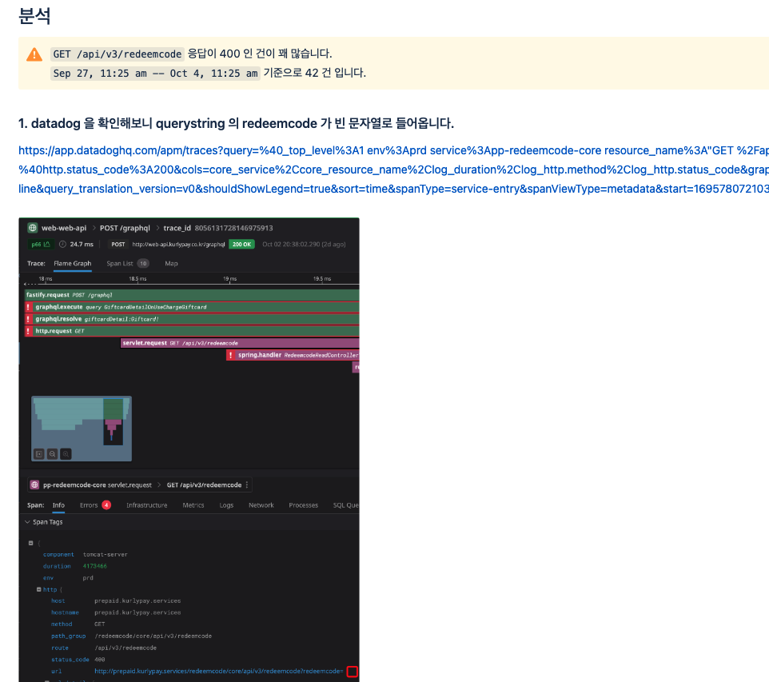

## Issue

- While monitoring the gift card API during the Chuseok holiday, I found 42 abnormal calls over the course of a week
- No issues had come in as VOCs, but I judged there could be a UX impact

*Background on discovering the abnormal calls while monitoring during Chuseok.*

## Analysis

Checking with Datadog, I found cases where the querystring's `redeemcode` came in as an empty string.

*Datadog showing the querystring redeemcode arriving as an empty string.*

Additional verification with Kibana showed 200 normal calls and 42 empty-string calls coming in together, with errors occurring in the empty-string cases.

*Kibana showing 200 normal calls alongside 42 erroring empty-string calls.*

## Improvement

After analyzing the call conditions, I requested the responsible owner to carry out the follow-up handling.
