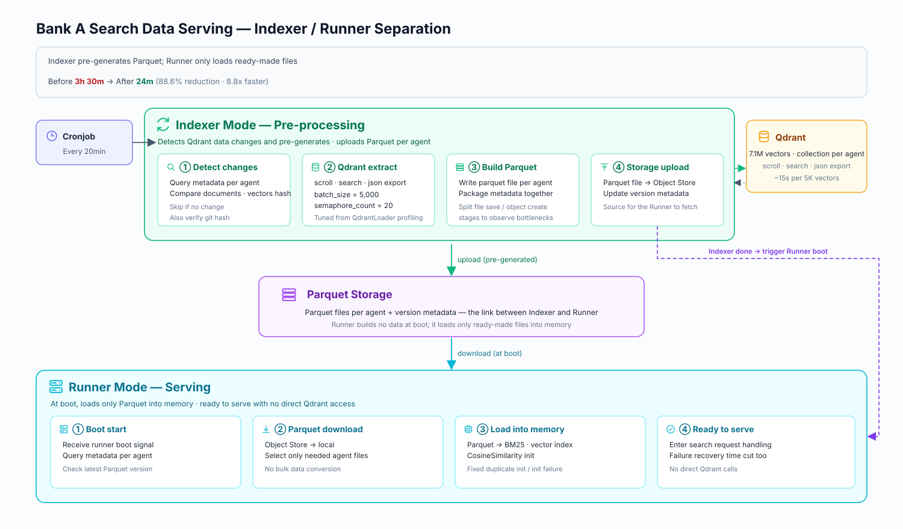

## Background

Bank A, where the project was already underway, needed stability validation for serving large-scale document/vector-based search data.  
The existing architecture prepared all data at once during runner boot time, so as the data volume grew, initialization time and failure recovery time became operational risks.

## Outcomes

- Reduced runner boot-time burden by separating responsibilities between Parquet pre-generation and the `indexer-runner`
- Separated the Qdrant query, file save, and object creation stages to observe bottlenecks and tuned batch size / semaphore count
- Identified the root causes of the QdrantLoader bottleneck, BM25 duplicate initialization, and CosineSimilarity initialization failure, and finalized operational parameters

| Category | Before | After | Outcome |
|---------------|---------------------|---------------------------------------|-----------------------|
| Indexer processing time | 3 hours 30 minutes | 24 minutes | 88.6% reduction, 8.8x improvement |
| Data serving preparation method | Build data at runner boot time | Indexer pre-generates Parquet | Eased initialization time and failure recovery burden |
| Operational parameters | Not measured | Batch size 5,000 / semaphore count 20 | Established baselines for large-scale data operations |

*Stability validation report summarizing the 7.1M-vector serving and indexing test results.*
