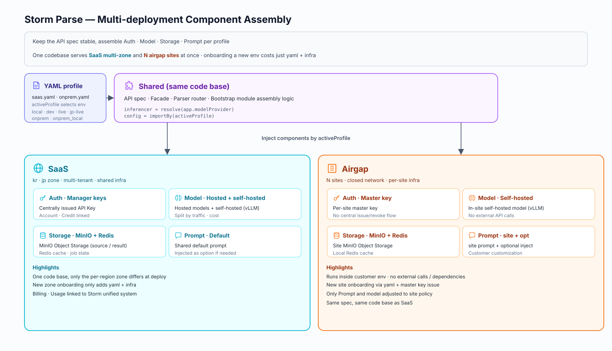
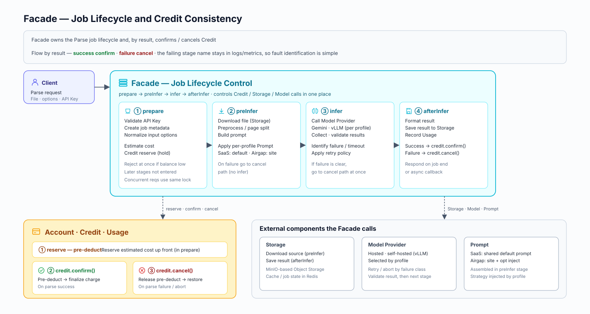

## Background

Storm Parse is a service that parses files into semantic units usable for search and inference.  
It was originally built for internal use, but as external customers who wanted only the Parse feature appeared, the need for a standalone API product emerged.

- It had to support the `kr` and `jp` SaaS zones together with customers' airgap environments
- We needed a structure that kept the API spec stable while assembling Auth, Model Provider, Storage, and Prompt differently depending on the runtime environment

## Impact

- Extended a parsing feature that had only been used internally into a public API product external customers can use directly, consolidating the Authn/Authz · Billing · Usage · Logs flows into one.
    - [Storm APIs Playground](https://www.sionicstorm.ai/ko/storm-apis/playground)
    - [Storm Parse API Docs - Apidog](https://storm-apis.apidog.io/storm-parse-1618742m0)
- With a [public session by TeddyNote](https://www.youtube.com/live/-7jZoe__kBE?si=Mh5kKTo9WIKuF-Sx) scheduled for 2025-08-06, I built it to a publicly releasable level within just two weeks of starting development.
    - Inquiries came in from various companies, and beyond the company's flagship Storm solution, it generated SaaS revenue for the first time.
- Designed an execution structure that accounts for both SaaS multi-region and airgap environments.
    - Built a foundation that separates SaaS zones such as `kr` and `jp` while supporting N airgap environments with minimal effort.

## Design & Implementation

To support SaaS multi-region (kr · jp) and N airgap environments simultaneously from the same codebase, I applied profile-based component assembly and Facade-centric job lifecycle control.

- Kept the API spec stable while allowing Auth · Model Provider · Storage · Prompt to be assembled differently per environment
- The Facade owns the parse job lifecycle (prepare → preInfer → infer → afterInfer) and, depending on the result, handles Credit confirm / cancel all in one place — simplifying billing consistency and fault-point identification
- Implemented the end-to-end flow from API Key through Account · Credit · Usage aggregation

