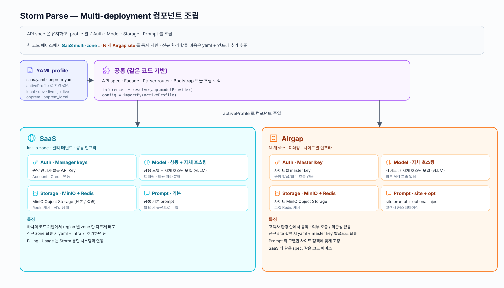
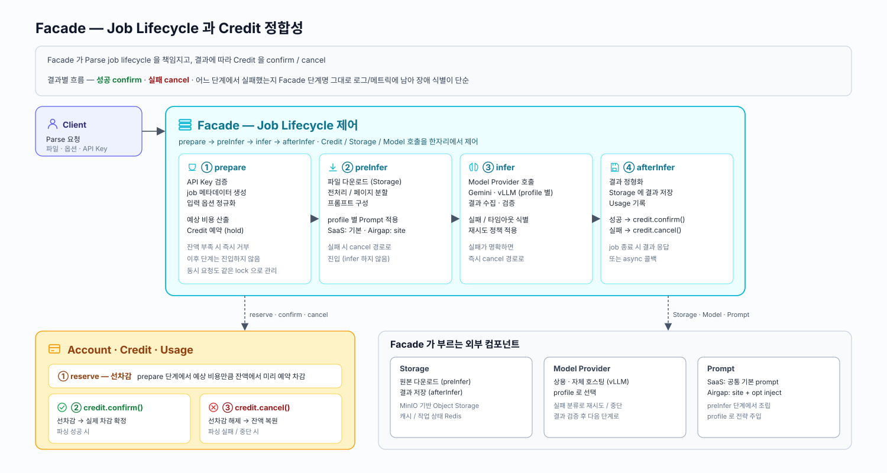

## 배경

Storm Parse 는 파일을 검색·추론에 사용할 수 있는 의미 단위로 파싱하는 서비스입니다.  
내부 전용으로 개발되었지만, Parse 기능만 원하는 외부 고객이 생기면서 독립 API 상품 니즈가 생겼습니다.

- `kr`, `jp` SaaS zone 과 고객사 On-Prem 환경을 함께 지원해야 했습니다
- API spec 은 유지하면서 실행 환경에 따라 Auth, Model Provider, Storage, Prompt 구성을 다르게 조립할 수 있는 구조가 필요했습니다

## 성과

- 내부에서만 사용되던 파싱 기능을 외부 고객이 직접 사용할 수 있는 공개 API 상품으로 확장하고, Authn/Authz · Billing · Usage · Logs 흐름을 하나로 정리했습니다
    - [Storm APIs Playground](https://www.sionicstorm.ai/ko/storm-apis/playground)
    - [Storm Parse API Docs - Apidog](https://storm-apis.apidog.io/storm-parse-1618742m0)
- 250806 [테디노트 공개 세션](https://www.youtube.com/live/-7jZoe__kBE?si=Mh5kKTo9WIKuF-Sx) 일정이 잡힌 상태에서, 개발 시작 2주만에 대외 공개가 가능한 수준으로 개발했습니다
    - 다양한 업체의 사용 문의가 들어왔고, 회사의 메인 상품인 Storm 솔루션 외에 처음으로 SaaS 매출이 발생했습니다
- SaaS 멀티 리전과 On-Prem 환경을 모두 고려한 실행 구조를 설계했습니다
    - `kr`, `jp` 등 SaaS zone 분리와 동시에 N개의 On-Prem 환경을 최소한의 작업으로 지원할 수 있는 기반을 만들었습니다

## 설계 및 구현

같은 코드 베이스로 SaaS 멀티 리전(kr · jp) 과 N 개의 On-Prem 환경을 동시에 지원하기 위해, profile 기반 컴포넌트 조립과 Facade 중심 job lifecycle 제어를 적용했습니다.

- API spec 은 유지하면서 환경별로 Auth · Model Provider · Storage · Prompt 를 다르게 조립할 수 있도록 했습니다
- Facade 가 parse job lifecycle(prepare → preInfer → infer → afterInfer) 을 책임지고, 결과에 따라 Credit 을 confirm / cancel 까지 한 자리에서 정리해 Billing 정합성과 장애 지점 식별을 단순화했습니다
- API Key 부터 Account · Credit · Usage 집계까지 이어지는 end-to-end 흐름을 구현했습니다

