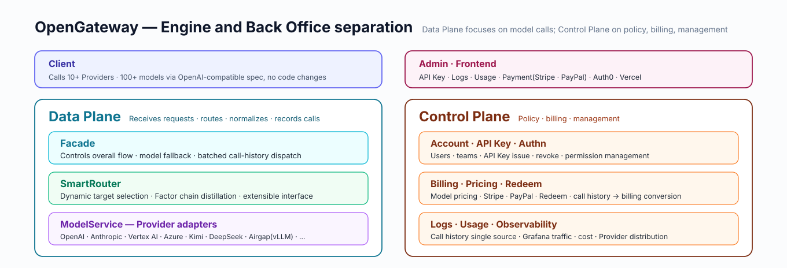
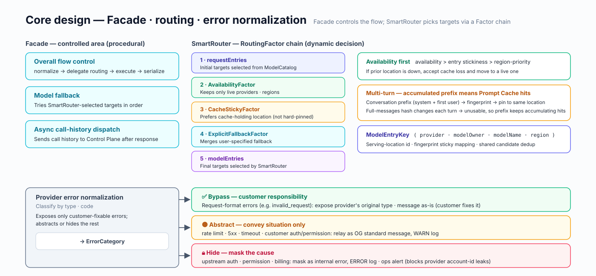
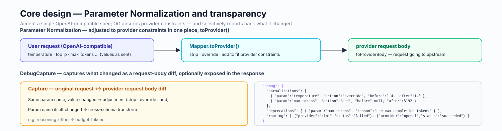
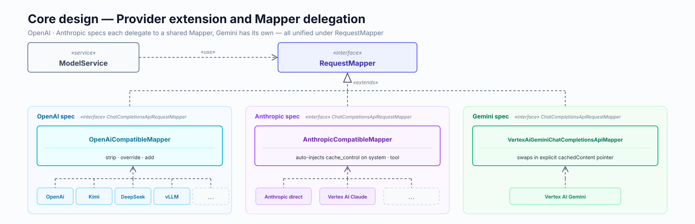
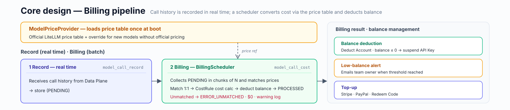
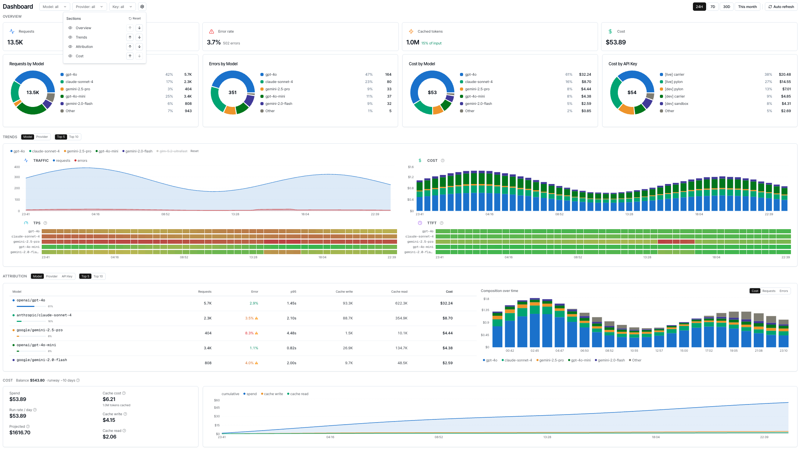
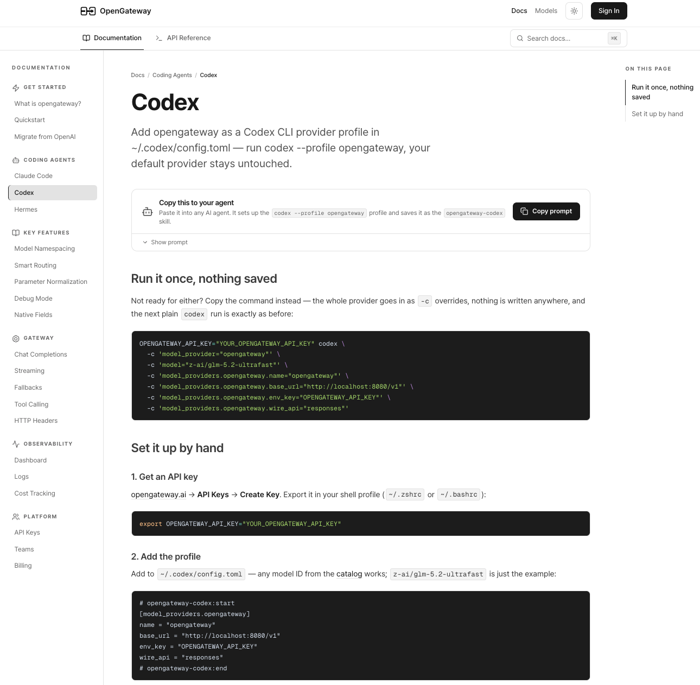
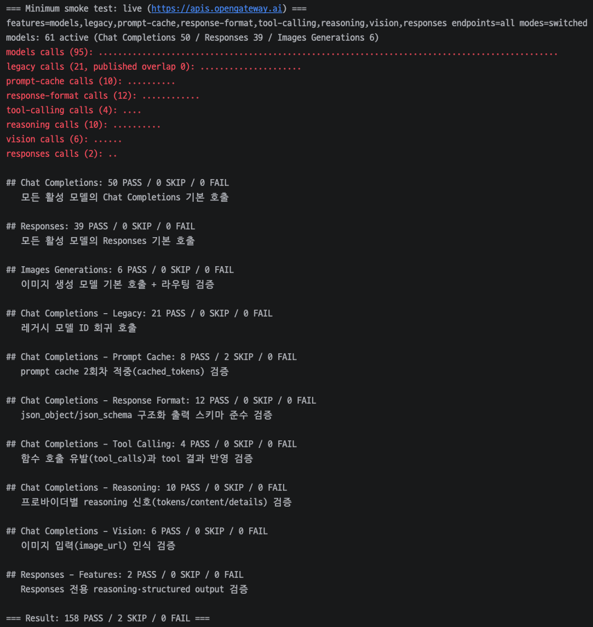

## Background

[OpenGateway](https://opengateway.ai/) is an AI Gateway that serves multiple Model Providers through an OpenAI-compatible API.  
It was initially developed as a feature used only by internal services, but as external customers wanting model routing emerged, the need arose to extend it into a standalone API product.

- Parameter compatibility and routing quality had to be maintained even as models and Providers changed across SaaS / airgap environments
- Considering zone separation such as `kr` and `jp` and airgap support, the internal composition needed to be flexibly assembled while preserving the OpenAI API spec

## Outcomes

- [opengateway.ai](https://opengateway.ai/) — live service
- Extended the existing internal model serving feature into an OpenAI-compatible public API Gateway product, building out every flow including API Key, Authn/Authz, Billing, Logs, and the frontend UI
- Designed availability-first routing, Prompt Cache stickiness, parameter/error normalization, and a shared compatibility Mapper delegation structure, enabling consistent expansion to 10+ Providers under a single OpenAI spec
- Stably serving traffic at the level of RPM 200 and Daily 280K, with 10+ Providers and 100+ models
- Connected Redeem Code, Admin features, Grafana observability, and model smoke/CI/daily tests to improve both operational observability and live stability

## Design and Implementation

To plan and develop 2 backends and 1 frontend simultaneously with one junior developer, I had to make active use of AI.

- Kept policies and work standards as a single source of truth in Skills, so that humans and AI could work in the same context
- Separated the flows to be controlled from dynamic decision-making in the system, clearly distinguishing the areas to review directly from the areas to delegate to AI
- More details are documented in [Thoughts on development that actively leverages AI](/en/portfolio/sionic-ai/05_ai-development-workflow/)

### Front Office

*Front Office dashboard with API usage, traffic, and performance metrics.*

<figure class="grid-cap">

*Request logs list with per-call status, model, and timing.*

</figure>

<figure class="grid-cap">

*Single log detail view showing request, routing, and response data.*

</figure>

### Docs

*Developer docs site with guides and OpenAI-compatible API reference.*

## Operational Stabilization

- Managed operational status using Grafana to observe traffic, cost, response time, and Provider distribution
- Standardized recurring operational tasks such as model addition/removal, SDK upgrades, releases, and weekly reports into Claude Skills, improving operational convenience
- Applied smoke tests, CI tests, and daily jobs to 10+ Providers and 100+ models to continuously verify live environment stability

*Grafana dashboard tracking traffic, cost, latency, and Provider distribution.*

*Live smoke-test results verifying Providers and models in production.*
