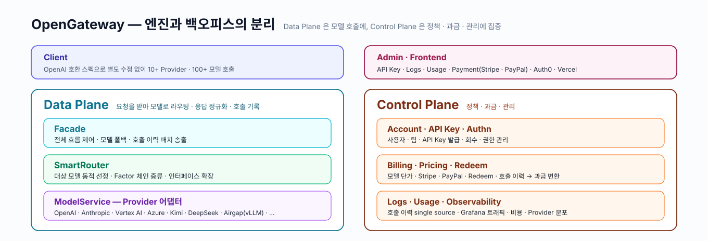
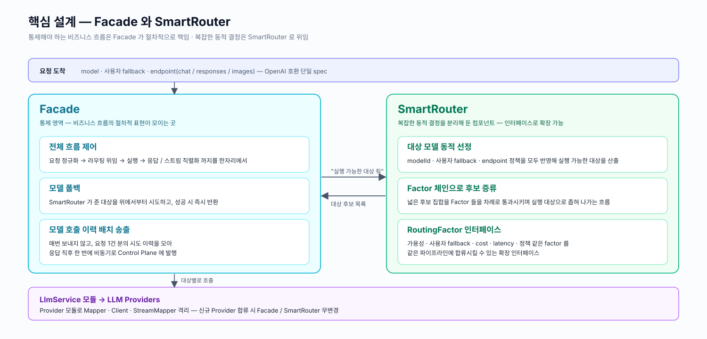
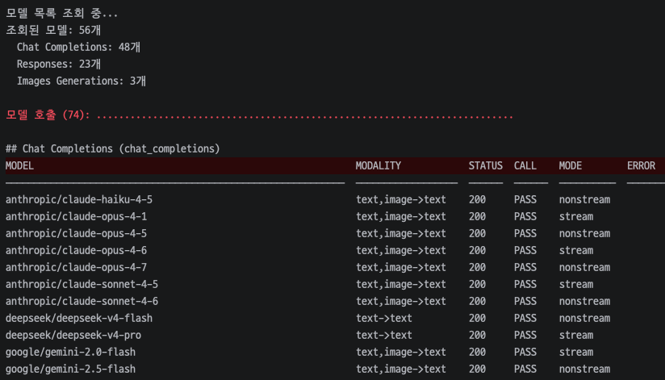

## 배경

[OpenGateway](https://opengateway.ai/) 는 여러 LLM Provider 를 OpenAI 호환 API 형태로 제공하기 위한 AI Gateway입니다.  
처음에는 내부 서비스에서만 사용하는 기능으로 개발되었지만, LLM routing 을 원하는 외부 고객이 생기면서 독립적인 API 상품으로 확장하는 니즈가 생겼습니다.

- SaaS / On-Prem 환경에서 모델과 Provider 가 바뀌어도 파라미터 호환성과 라우팅 품질을 유지해야 했습니다
- `kr`, `jp` 등 zone 분리와 On-Prem 지원을 고려해, OpenAI API spec 은 유지하면서 내부 구성을 유연하게 조립할 수 있어야 했습니다

## 성과

- 기존 내부 LLM 서빙 기능을 OpenAI 호환 공개 API Gateway 상품으로 확장하고, API Key, Authn/Authz, Billing, Logs, 프론트 화면까지 모든 흐름을 구축했습니다
- RPM 180, Daily 250K 수준의 트래픽, 10+ Provider, 100+ 모델을 안정적으로 서빙하고 있습니다
- Redeem Code, Admin 기능, Grafana 관측, 모델 smoke/CI/daily test 를 연결해 초기 사용자 유입과 운영 관측성, live 안정성을 함께 개선했습니다

## 설계 및 구현

1명의 주니어 개발자와 함께 백엔드 2개 · 프론트 1개를 동시 기획 · 개발하기 위해 AI 를 적극적으로 활용해야 했습니다.

- 정책과 작업 기준은 Skill 로 single source of truth 로 두어, 사람과 AI 가 같은 맥락에서 작업할 수 있도록 했습니다
- 시스템은 통제할 흐름과 동적 의사결정을 분리해, 직접 검토할 영역과 AI 에게 위임할 영역을 명확히 구분했습니다
- 더 자세한 내용은 [AI를 적극적으로 활용하는 개발에 대한 생각](/portfolio/sionic-ai/05_ai-development-workflow/)에 정리되어 있습니다

## 운영 안정화

- Grafana 기반으로 트래픽, 비용, 응답 시간, Provider 분포를 관측하며 운영 상태를 관리했습니다
- 모델 추가/제거, SDK 업그레이드, 릴리즈, 주간 보고 등 반복 운영 업무를 Claude Skill 로 표준화해 운영 편의성을 높였습니다
- 100개 이상의 모델에 smoke test · CI test · daily job 을 적용해 live 환경 안정성을 지속 확인했습니다

