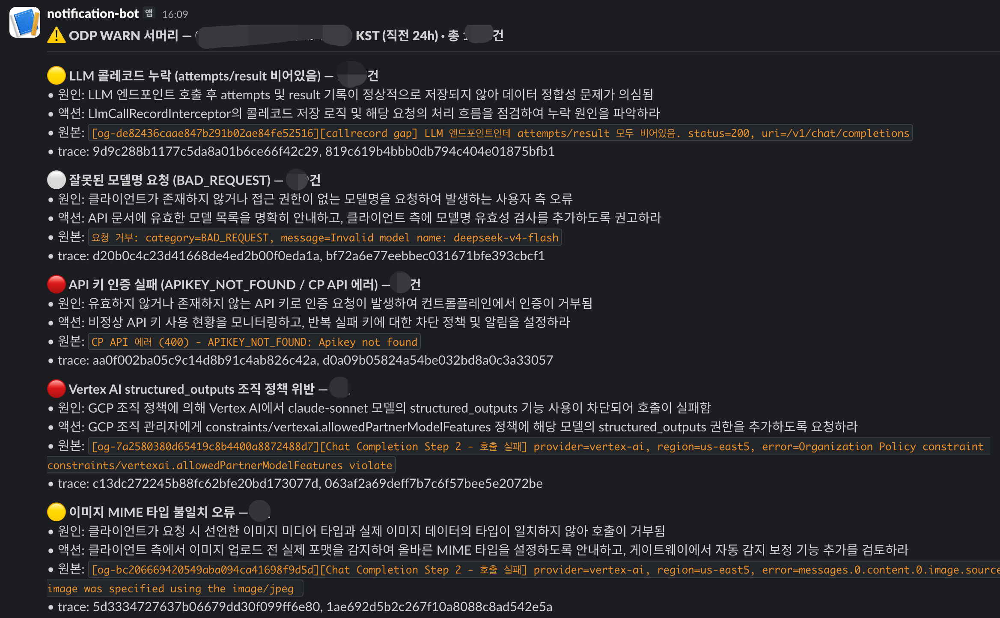
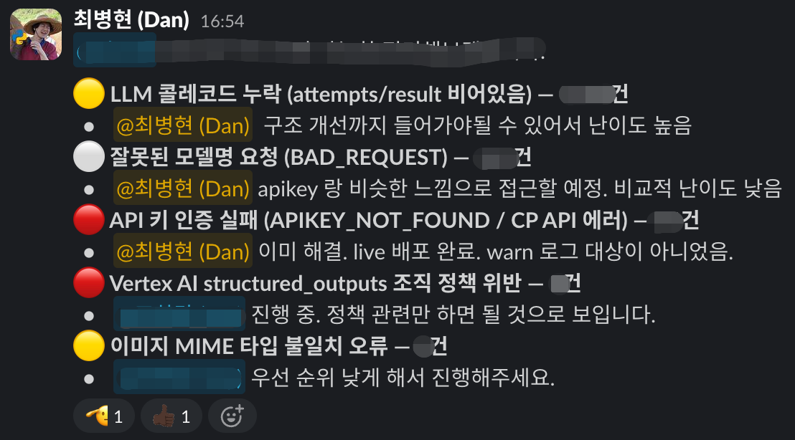

## Background

Leveraging AI accelerated product development, but conversely, work in the gray areas where responsibility across services was unclear became easier to overlook.

- API documentation, test scenarios, test methodologies, and error response formats were managed differently across each service
- Documentation and testing that relied on external SaaS tools had to be moved to in-house tools deployed alongside the code so they could be used even in airgap environments
- There was a lot of work in gray areas that was necessary but either not part of the official product's features or had ambiguous ownership

## Outcomes

- Established documentation and testing flows that work even in airgap environments, using an in-house OpenAPI-based API Hub and regression test automation
- Improved operational convenience by developing tools for payment link generation, PG merchant/settlement management, parsing result comparison, and back-office verification tasks
- Built a system that aggregates and classifies WARN logs daily with AI to proactively detect potential failures, closing the blind spots that ERROR alerts alone had missed
- Organized and disseminated NewRelic, structured logging, standard Error DTOs, and Skill authoring standards, establishing a foundation for the team to develop/test/operate against the same standards

## Details

### API Hub — documentation and spec standardization

To support airgap environments, I moved documentation and testing that had been managed in an external SaaS (Apidog) to an in-house OpenAPI-based Hub.

<figure class="grid-cap">

*The early API Hub built on the external Apidog SaaS for documentation and testing.*

</figure>

<figure class="grid-cap">

*The in-house OpenAPI-based Hub that replaced Apidog for airgap environments.*

</figure>

### Strengthened Monitoring

By automating and aggregating tests and logs, I shifted problem detection from after the fact to ahead of time.

- **Regression tests**: Replaced manual scenarios that relied on external tools with Python scripts and a scheduler, and verified that existing behavior did not break through scheduled runs and post-deployment runs, increasing service reliability
- **WARN log AI report**: Each day, AI groups easily-buried WARN logs by type and compiles a report covering cause, action, and trace, which is sent to Slack and triaged for proactive response before issues become failures

*Regression scenario runner on a schedule, reporting results to Slack.*

<figure class="grid-cap">

*Daily AI report grouping WARN logs by type with cause, action, and trace.*

</figure>

<figure class="grid-cap">

*Triage of each reported WARN type with difficulty and priority notes.*

</figure>

### Operations Support Tooling

- **onepage-payment**: Enables operators to handle payment link generation and delivery to customers directly
- **storm-differ**: Compares Storm Parse results by parser and model to track quality changes
- **BO**: Handles recurring operational requests for services with no records or ambiguous ownership through UI and data flows

<figure class="grid-cap">

*onepage-payment screen where operators generate and send payment links to customers.*

</figure>

<figure class="grid-cap">

*storm-differ comparing Storm Parse results across parsers and models.*

</figure>

### Operations Standardization Contributions

- Organized API Keys/permissions for external services (Anthropic, OpenAI, Vertex AI, GitHub) and per-service access scopes
- Organized NewRelic, logback, and structured logging standards
- Documented standard Error DTOs and maintainable Skill authoring methods
- Configured [common-config](https://github.com/Hyune-s-lab/my-spring-cloud-config) with a Git / Vault repository as the backend, querying configuration through the standard Spring Cloud Config API so that feature toggles and shared settings can be managed even in airgap environments
