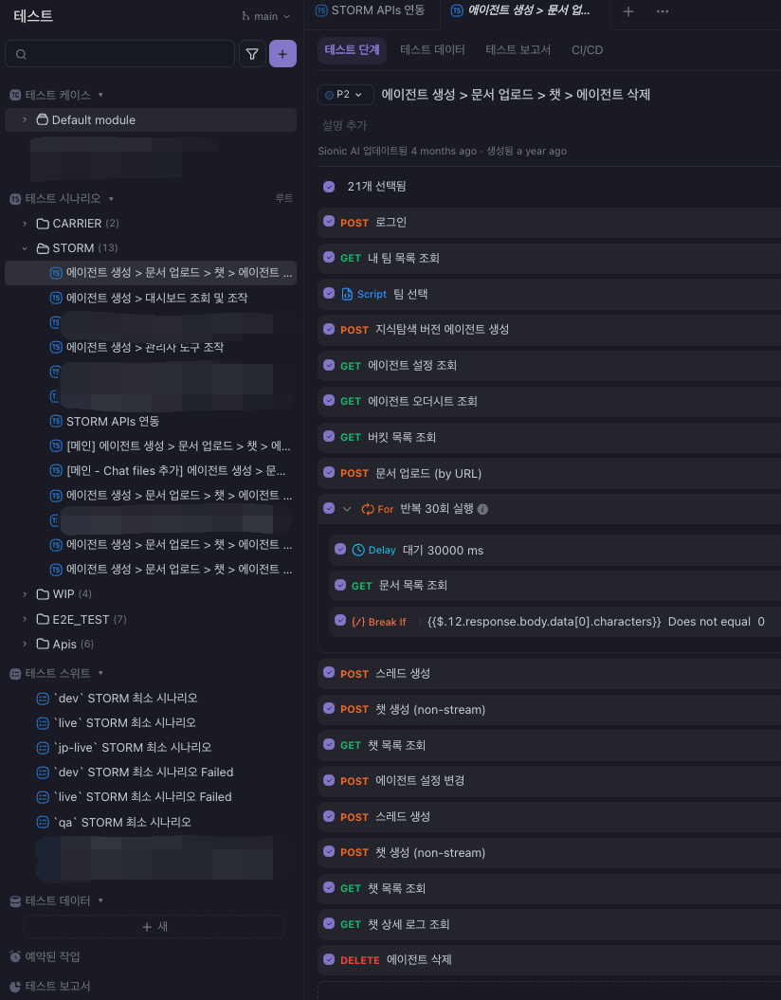
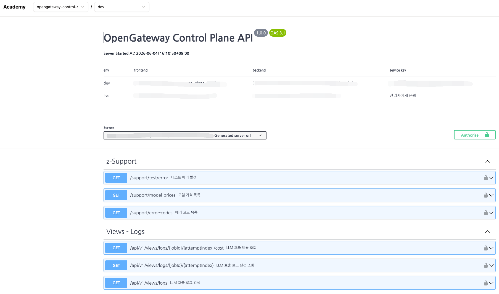
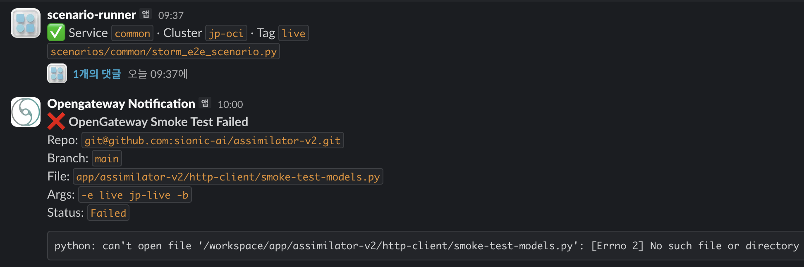
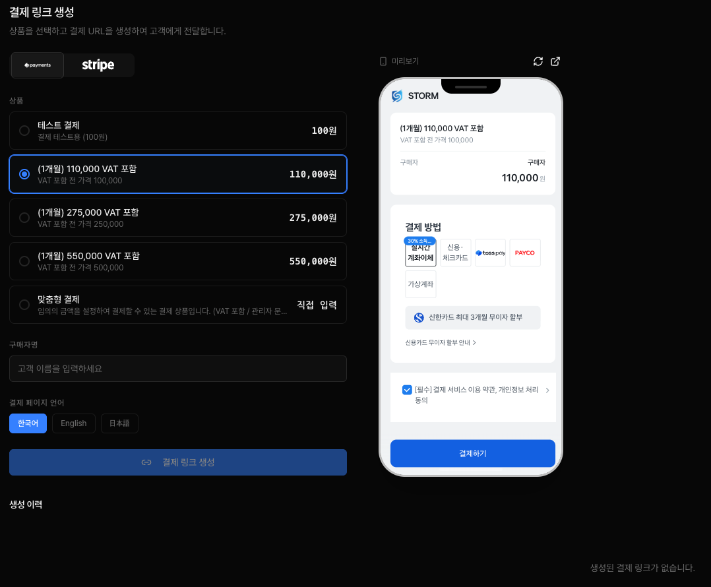

## 배경

AI 활용으로 제품 개발 속도는 빨라졌지만, 반대로 서비스 간 책임 소재가 명확하지 않은 회색 영역의 업무는 누락되기 쉬워졌습니다.

- API 문서, 테스트 시나리오, 테스트 방법론, 에러 응답 형식이 서비스마다 제각각 다르게 관리되었습니다
- 문서·테스트를 외부 SaaS 도구에 의존하고 있었지만, 인터넷이 차단된 airgap 환경에서는 사용할 수 없어 코드와 함께 배포 가능한 자체 도구가 필요했습니다
- 필요하지만 정식 제품의 기능이 아니거나 책임 소재가 모호한 회색 영역의 업무가 많았습니다

## 성과

- Apidog 에서 Swagger(OAS 3.1) 기반 자체 API Hub로 전환하고 시나리오 테스트를 Python 스크립트·스케줄러로 자동화해, airgap 환경에서도 동작하는 문서·테스트 흐름을 정착시켰습니다
- 결제 링크 생성, PG 가맹점/정산 관리, 파싱 결과 비교, 백오피스성 확인 업무 등을 위한 도구를 개발해 운영 편의성을 높였습니다
- NewRelic, 구조적 로깅, 표준 Error DTO, Skill 작성 기준을 정리하고 전파해 팀이 같은 기준으로 개발/테스트/운영할 수 있는 기반을 만들었습니다

## 상세

### API Hub와 테스트 흐름 표준화

초기에는 Apidog 기반 API Hub 로 API 문서·테스트 시나리오·외부 공유 문서를 한 곳에서 관리했지만, 인터넷이 차단된 airgap 환경을 지원하려면 외부 SaaS 에 의존할 수 없어 코드와 동기화되는 자체 도구로 발전시켰습니다.

- **API Hub**: Apidog 에서 Swagger(OAS 3.1) 기반 자체 Hub 로 전환해, 코드에서 생성되는 스펙을 dev/live 환경별로 분리해 제공하고 문서와 실제 API 동작의 불일치를 제거
- **시나리오 테스트**: 외부 도구의 수동 시나리오를 Python 기반 테스트 스크립트와 별도 스케줄러로 대체해, e2e/smoke 시나리오를 정기 실행하고 Service·Cluster·Tag 단위 결과를 Slack 으로 통보

### 운영 보조 도구 개발

- `onepage-payment` 결제 링크 생성과 고객 전달을 운영자가 직접 처리할 수 있도록 지원
- `storm-differ` Storm Parse 결과를 파서·모델 기준으로 비교해 품질 변화 확인할 수 있도록 지원
- `BO` 기록이 없거나 책임이 모호한 서비스의 반복 운영 요청을 화면·데이터 흐름으로 처리할 수 있도록 지원

### 운영 표준화 기여

- 외부 서비스 (Anthropic, OpenAI, Vertex AI, GitHub) API Key·권한과 서비스별 접근 범위 정리
- NewRelic, logback, structured logging 기준 정리
- 표준 Error DTO 와 유지보수 가능한 Skill 작성 방식 문서화
- [common-config](https://github.com/Hyune-s-lab/my-spring-cloud-config) Git / Vault 저장소를 백엔드로 두고 Spring Cloud Config 표준 API 로 설정을 조회, airgap 환경에서도 feature toggle·공통 설정을 관리할 수 있도록 구성
