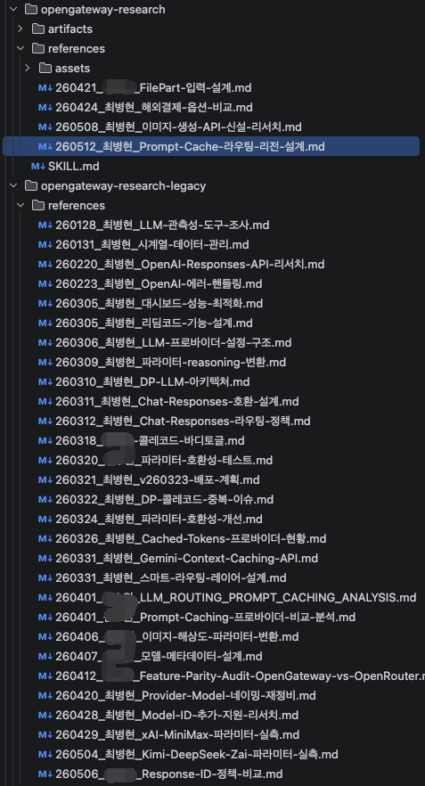
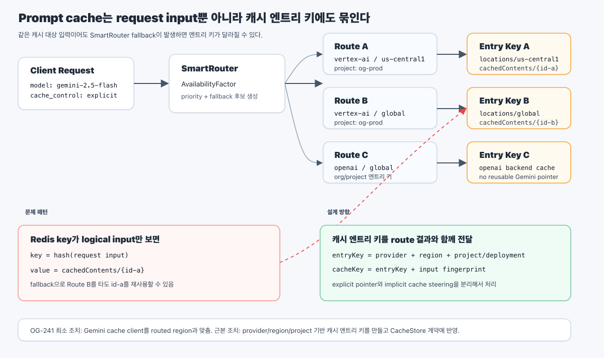
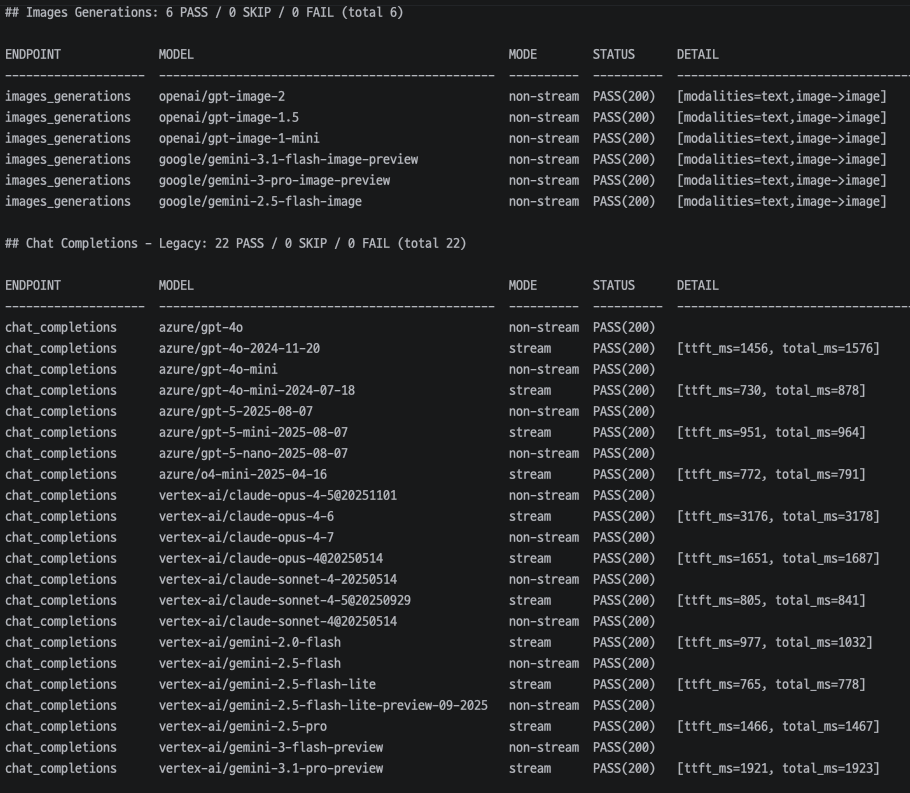

AI 는 실무 개발의 필수 도구가 되었습니다. 하지만 같은 도구를 써도 숙련도에 따라 결과의 수준은 크게 달라집니다.

- Ralph Loop 등을 활용해 빠르게 결과를 만들 수 있지만 엣지 케이스 · 예외 처리 · 장애 복구가 빠지기 쉽고, B2B 에이전트처럼 대량의 암묵지를 다루는 영역은 모델·프롬프트만으로 안정적인 결과를 만들기 어렵습니다
- Agentic Coding · Harness Engineering · Hermes 같이 hype 한 단어들은 빠르게 바뀌지만, 본질은 결국 "AI 를 잘 다루기 위한 업무 흐름 설계" 라는 점은 변하지 않습니다
- 새 도구를 따라가기만 하는 것 보다는 CS 기본 지식, 경험에서 나오는 직관, 코드 스멜과 복잡도 제어, 그리고 AI 의 그럴듯한 답을 비판적으로 수용하는 능력이 더 중요합니다

## 통제 영역과 위임 영역의 분리

AI 를 활용하는 데 있어 가장 중요한 결정은 **통제해야 하는 영역과 위임 가능한 영역을 분리하는 것** 이라고 생각합니다. 실무는 그저 돌아가는 것만이 아니라 운영을 위한 정합성과 지속 가능성이 더 중요하기 때문입니다.

- **통제해야 하는 영역** — 도메인 규칙, 비즈니스 흐름, 상태 전이, 인증/과금, 장애 복구, 외부 API spec
- **위임 가능한 영역** — 멱등하게 테스트 가능한 컴포넌트, UI 구성, 반복적인 boilerplate, 문서 초안

두 영역을 명확히 나누려면 역설적으로 **설계와 문서화에 더 많은 시간** 을 써야 합니다. 레이어 설계가 선행돼야 통제 영역을 떼어낼 수 있고, 그 과정에서 관심사가 자연스럽게 나뉘면서 의사결정이 문서로 남게 됩니다.

전체를 위임하기보다 분할 정복에 가까운 접근입니다. 사람의 개입이 필요한 범위는 줄이고, 위임한 부분은 테스트와 계약만으로 검증합니다. 이런 관점에서는 보통 말하는 Hexagonal 이나 OOP 보다 **Facade + 멀티모듈** 구조가 더 잘 맞았습니다. 통제 흐름은 Facade 한 자리에 모으고, 나머지는 명확한 입출력 계약을 가진 컴포넌트로 분리했습니다.

### 회귀 테스트와 코드 검수

이런 구조가 자리잡은 뒤로 저는 코드 작성 자체는 AI 에게 맡기고, **통제 영역의 설계와 코드 검수, PR 리뷰에 시간을 더 쓰고 있습니다**. 통제 영역에 시간을 쓰는 이유는 AI 의 환각을 통제하고 도메인 지식을 기반으로 더 좋은 설계 결정을 내리기 위해서이고, 위임 영역은 그 좋은 설계의 결과로 자연스럽게 분리된 부분이라 AI 에게 안전하게 맡길 수 있습니다.

이 흐름을 안전하게 받쳐주는 것은 통제 영역의 회귀 테스트입니다. AI 가 빠르게 만들어내는 변화 속에서도 통제 영역이 깨지지 않는지 자동으로 검증합니다.

- 핵심 호출 경로를 입력 조건 매트릭스로 정의하고, 실제 프로덕션 환경으로 호출해 기대 결과를 만족하는지 확인합니다
- 테스트를 만들기에는 현실적인 제약이 있는 경우 QA 단계로 보완합니다

## [OpenGateway](/portfolio/sionic-ai/03_opengateway/) 는 이런 생각들을 잘 적용한 사례입니다

1명의 주니어 개발자와 백엔드 2개 · 프론트 1개를 동시 기획·개발하면서도 일관된 맥락과 정책을 유지했습니다.

- 백엔드 2개 · 프론트 1개 · 정책 레포 1개의 4개 레포를 Skill 로 묶어 single source of truth 로 관리했습니다
- AI 와의 긴 대화간 일관성 유지와 동료와의 도메인 지식 공유를 위해 **handover 개념을 리서치 문서라는 이름으로** 도입했고, 사람이 읽기 위한 가시성 있는 자료와 AI 를 위한 내용들로 분리하여 작성했습니다
- 복잡한 주제는 **리서치 문서 → 동료 리뷰 → 정식 정책 승격** 으로 단계화해, 리서치 문서가 과거 의사 결정의 근거와 재조사 기반 자료로 자연스럽게 재활용됩니다

- 핵심 기능에 회귀 테스트를 적용해 변경 시점마다 주요 동작이 깨지지 않는지 검증합니다

## 적극적인 실험과 학습

AI 를 항상 통제하면서만 쓰지는 않습니다. 양쪽을 모두 알아야 더 좋은 방법론을 도출할 수 있다고 생각하기에, 영향 범위가 제한된 사이드 프로젝트나 마이너 개발건에서는 적극적으로 위임해봅니다.

- 프론트엔드 · 파이썬 개발과 `코드를 보지 않고 머지합니다` 의 철학으로 만든 사이드 프로젝트 [read4ai](https://github.com/read4ai/read4ai-excel)
- Claude Code 버전 히스토리에 관심을 가지고 LLM API 를 직접 호출해보며 업무 흐름에 적용 가능한 것들을 학습합니다
- 사용 도구도 계속 조정합니다. 초기 `cmux + Claude Code + Codex plugin` 조합에서, Opus 4.7 이후 체감 성능 저하로 현재는 Codex 중심으로 전환했습니다
- LinkedIn · GeekNews · release note 등으로 AI 정보를 습득하고 팀에도 공유합니다
