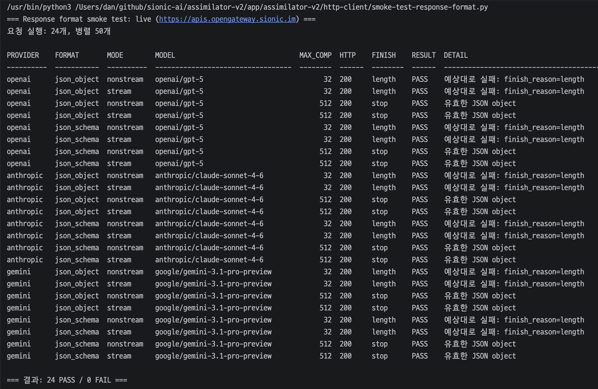

AI는 이미 실무 개발에서 필수적인 존재가 되었습니다.  
하지만 같은 도구라도 사용하는 사람의 숙련도와 개발 흐름에 따라 결과물의 수준은 크게 달라집니다.

- Ralph Loop 등을 활용해 빠르게 결과를 만들 수 있지만, 엣지 케이스·예외 처리·운영 복구 흐름이 부족한 경우가 많았습니다
- B2B 에이전트는 대량의 지식과 암묵지를 다루기에, 모델·프롬프트만으로는 안정적인 결과를 만들기 어렵습니다

## 도구보다 중요한 것

Agentic Coding, Harness Engineering, Hermes 같은 Hype 한 단어들이 계속 나오고 있지만, 항상 따라가야 된다고 생각하지는 않습니다.

- 새로운 도구가 최고의 효율을 보일 수 있지만, OpenClaw에서 Hermes로 관심이 옮겨가는 것처럼 도구의 최전선은 빠르게 바뀝니다. 학습 비용과 초기 버전의 불안정성도 가져옵니다
- Harness Engineering도 말은 거창하지만, 본질은 AI를 잘 다루기 위한 업무 흐름 설계에 가깝습니다

결국 실무 개발자에게 중요한 것은 프로덕트를 만들고 유지보수하는 능력입니다.  
새로운 도구보다는 AI와 함께하는 업무에 특화된 하네스와 운영 노하우, 그리고 CS와 같은 기본 지식, 경험에서 나오는 직관, 코드 스멜을 감지하고 복잡도를 제어하는 능력이 더 중요하다고 생각합니다.

- 언어와 프레임워크의 숙련도는 상당 부분 AI로 넘어가고 있고, 저 역시 과거에는 쉽게 접근하기 힘들었던 파이썬과 프론트엔드 개발을 실무 레벨로 병행하고 있습니다
- 특정 기술의 높은 숙련도보다는 문제를 해결하기 위한 키워드와 개념을 뽑아내는 능력이 더 중요해지고 있고, 부족한 숙련도는 AI를 활용해 결론을 도출할 수 있습니다

그리고 AI는 모듈화, 추상화, 테스트 가능성, 상태 관리, 장애 격리 같은 기술적인 주제에 대해 그럴듯한 답을 잘 만들어냅니다.  
불필요한 wrapper를 만들어 복잡도를 높이기도 하며, 너무 원칙에 가까운 대답만 하기도 합니다.  
그렇기에 AI의 제안을 비판적으로 수용해서 현재 시스템과 운영 맥락에 맞는지를 판단하는 것은 여전히 개발자의 역할입니다.

## AI와 잘 개발하기 위해

### 문서화와 설계 선행

AI에게 많은 구현을 맡기려면 역설적으로 설계에 더 많은 시간을 써야 합니다.  
통제 영역을 분리하기 위한 기본 레이어 설계가 필요하고, 그 과정에서 관심사가 자연스럽게 분리됩니다. 새로운 요건도 이미 분리된 관심사의 일부가 되기 때문에 생각의 범위는 작아지고, 의사결정·업무 내용을 문서로 남겨 동료와 공유하는 흐름이 자연스러워집니다.

### 통제 영역의 분리

AI 활용에 있어 가장 중요한 점은 통제해야 하는 영역과 위임 가능한 영역을 분리하는 것입니다.  
실무는 단순히 돌아가는 것만이 아니라 정합성과 지속 가능성이 더 중요하기 때문입니다.

- 통제해야 하는 영역: 도메인 규칙, 비즈니스 흐름, 상태 전이, 인증/과금, 장애 복구, 외부 API spec
- 위임 가능한 영역: 멱등하게 테스트 가능한 컴포넌트, UI 구성, 반복적인 boilerplate, 문서 초안

결국 AI와의 개발은 전체를 위임하는 것보다 분할 정복 방식에 가깝습니다.  
검토할 부분과 자동 검증할 부분을 나누면서 리뷰 범위는 줄이고, 위임한 부분은 테스트와 계약만으로 검증할 수 있습니다.

이런 관점으로 개발하다 보니 보편적으로 알려진 Hexagonal Architecture나 OOP 구조보다는 비즈니스 흐름의 절차적 표현이 용이한 Facade와 멀티모듈 기반의 컴포넌트 구조가 더 적합하다고 느꼈습니다. 중요한 업무 흐름은 Facade에 두어 통제의 대상이 되고, 나머지 컴포넌트는 테스트와 명확한 입력/출력 계약으로 위임할 수 있었습니다.

### 통제 영역의 회귀 테스트

AI에게 위임하기 어려운 업무 로직은 단순 유닛 테스트로 끝나지 않습니다.  
입력 조건과 외부 의존성의 조합이 많아, 변경이 생길 때마다 사용자 측에서 바로 깨지는 회귀가 발생할 수 있기 때문입니다.

- 핵심 호출 경로를 입력 조건의 매트릭스로 정의하고, 실제 프로덕션 환경으로 호출해 기대 결과를 만족하는지 확인합니다
- AI가 위임 영역을 빠르게 만드는 만큼, 회귀 테스트가 그 속도를 안전하게 받쳐 줍니다

다만 시간·비용·외부 의존성 같은 제약이 있는 경우 현실적인 대안으로 QA 단계로 보완하기도 합니다.

### [OpenGateway](/portfolio/sionic-ai/03_opengateway/) 개발은 위의 방식을 잘 적용한 사례입니다

1명의 주니어 개발자와 2개의 백엔드 · 1개의 프론트를 동시에 기획·개발하면서도 일관된 맥락과 정책을 유지할 수 있었습니다.

- 정책과 작업 기준을 Skill 로 관리해 프로젝트의 single source of truth 로 두었습니다

```text
opengateway-data-plane-backend/       # OpenAI 호환 Gateway, Provider 라우팅, 모델 서빙
opengateway-control-plane-frontend/   # Admin, 로그, 사용량, API Key 관리 화면
opengateway-control-plane-backend/    # 계정, 과금, 사용량 기록, 내부 Admin API

opengateway-claude-skills/            # 레포별 정책, 리서치, AI 작업 기준
├── opengateway-core/                 # 공통 정책, 아키텍처, 과금, 인증
├── opengateway-research/             # 진행 중인 리서치
├── opengateway-research-legacy/      # 보관 중인 과거 리서치
├── opengateway-cp-be/                # Control Plane Backend 정책
├── opengateway-cp-fe/                # Frontend 정책
├── opengateway-dp-be/                # Data Plane Backend 정책
```

- AI 긴 대화 일관성과 동료 도메인 지식 공유를 위해 **handover 개념을 리서치 문서로** 도입했습니다. 사람보다 AI가 읽기 좋게 시각 자료 1개와 서술형 본문으로 압축해 관리합니다
- 복잡한 주제는 **리서치 문서 → 동료 리뷰 → 정식 정책 승격** 순으로 단계화하며, 그 결과 리서치 문서는 과거 의사 결정의 근거나 재조사 시 기반 자료로도 자연스럽게 재활용됩니다

<div class="img-grid-2" style="grid-template-columns: 1fr 2fr;">


</div>

- 핵심 호출 경로에 회귀 테스트를 적용해, 변경 시점마다 회귀를 차단하고 있습니다



## 적극적인 실험과 학습

하지만 AI를 항상 통제하면서만 사용하지는 않습니다. 양쪽을 알아야 더 잘 사용할 수 있다고 생각하기에, 영향 범위가 제한된 사이드 프로젝트나 마이너 개발건에서는 AI를 더 적극적으로 활용하고 있습니다.

- 프론트엔드·파이썬 개발, 그리고 `코드를 보지 않고 머지합니다`의 철학으로 만든 사이드 프로젝트 [read4ai](https://github.com/read4ai/read4ai-excel)

그리고 AI에서 가장 좋은 학습법은 직접 써보는 것입니다.

- Claude Code의 버전 히스토리 등에 관심을 가지고 LLM API를 직접 호출해보면서 제 업무 흐름에 적용 가능한 것들을 지속적으로 학습합니다
- 사용하는 도구도 계속 조정합니다. 초기에는 `cmux + Claude Code + Codex plugin` 조합을 사용했지만, Opus 4.7 이후 체감되는 성능 저하로 현재는 Codex 중심으로 전환했습니다
- LinkedIn, GeekNews, release note 등을 통해 꾸준히 AI 정보를 습득하고 팀에도 공유합니다
