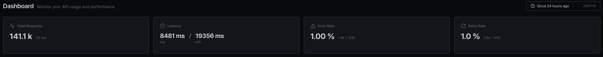
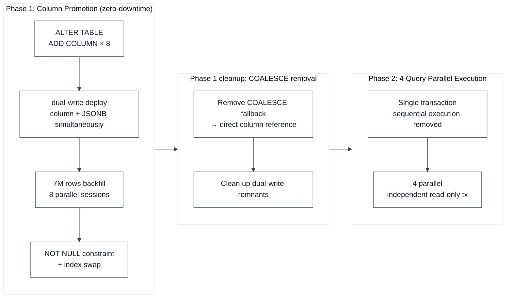

## Issue

- A heavy-user customer experienced noticeably slow dashboard performance
- Teams with more data saw progressively worse performance

## Analysis

In early development, the table behind the dashboard used JSONB for **flexibility**.  
Since it was a ledger-style log table, NoSQL was also considered, but due to operational constraints the solution had to stay within PostgreSQL, and as data accumulated, a bottleneck emerged.

- Rendering the 4 KPI cards on the dashboard — the first page after login — required extracting values from JSONB
- But extracting, casting, and computing JSONB fields on every row meant the response was slow at 7,548ms



```sql
-- Before: extract JSONB field per row → cast → compute
CASE
    WHEN data->'timestamps'->>'respondedAt' IS NOT NULL
         AND data->'timestamps'->>'attemptedAt' IS NOT NULL
    THEN (EXTRACT(EPOCH FROM (data->'timestamps'->>'respondedAt')::timestamptz)
        - EXTRACT(EPOCH FROM (data->'timestamps'->>'attemptedAt')::timestamptz)) * 1000
END
```

### What I tried

- **Expression index**: Helped WHERE filtering, but aggregation still parsed every row
- **GIN index**: Fast for key-existence lookups, but low impact for value extraction and aggregation.

## Improvement

Chose to promote frequently used fields from JSONB into real columns.

- Zero-downtime migration of 7M+ rows, heavy user dashboard response 7,548ms → 651ms (11.6x improvement)



### Phase 1: Column Promotion (zero-downtime)

> **JSONB expression → 8 real columns. Resolved the core bottleneck.**

The promoted fields are the ones used for filtering and aggregation across all queries — status, provider, model, timestamps, etc.

> **7M rows parallel backfill — A single session estimated at 2+ hours was split by date range into 8 sessions, completed in under 10 minutes total.**

Splitting avoids long transactions.

- A single UPDATE causes bloat and replication lag from snapshot retention, and rolls back everything on failure
- Partitioned by `created_at` date range instead of `ctid` (which changes during UPDATE). `RowExclusiveLock` doesn't block service traffic
- `VACUUM` after backfill to reclaim dead tuples

### Phase 1 cleanup: COALESCE removal

After backfill, removed `COALESCE` fallback and dual-write remnants, switching to direct column references.

### Phase 2: 4-Query Parallel Execution

Switched 4 sequentially executed queries in a single transaction to parallel, converging total response time from 7,548ms to the slowest query.

```kotlin
// Before: sequential execution (single transaction) — ~7,548ms total
fun getDashboard(...): Dashboard = transaction(readOnly = true) {
    Dashboard(
        kpi = dashboardQueryRepository.getKpi(...),
        traffic = dashboardQueryRepository.getTraffic(...),
        latency = dashboardQueryRepository.getLatency(...),
        cost = dashboardQueryRepository.getCost(...)
    )
}

// After: parallel execution (each query independent transaction) — converges to slowest query
Executors.newVirtualThreadPerTaskExecutor().use { executor ->
    val kpi = executor.submit<Kpi> { transaction(readOnly = true) { ... } }
    val traffic = executor.submit<List<Traffic>> { transaction(readOnly = true) { ... } }
    val latency = executor.submit<List<Latency>> { transaction(readOnly = true) { ... } }
    val cost = executor.submit<List<Cost>> { transaction(readOnly = true) { ... } }
    Dashboard(kpi = kpi.get(), traffic = traffic.get(), latency = latency.get(), cost = cost.get())
}
```

