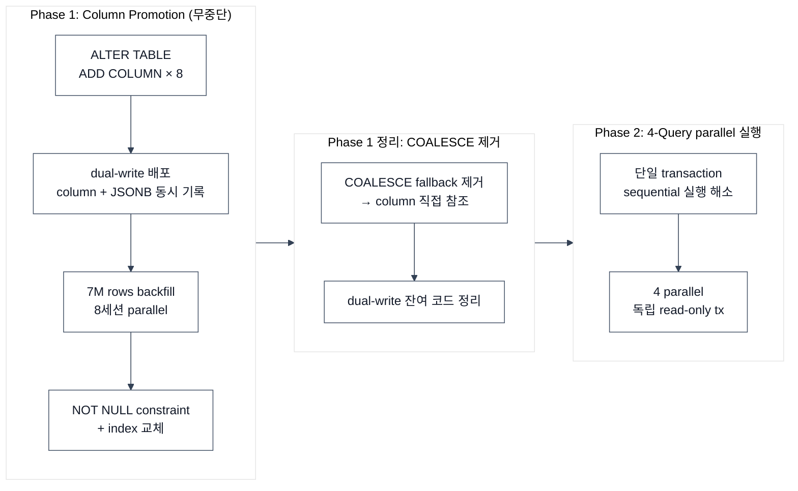

## 이슈 상황

- 헤비유저인 고객이 대시보드를 사용할 때 눈에 띄게 느린 현상이 발생했습니다
- 특히 데이터가 많은 팀일수록 체감 성능이 급격히 악화되었습니다

## 분석

초기 개발 과정에서 대시보드의 기반이 되는 테이블은 **유연성**을 위해 JSONB를 활용했습니다.  
원장 성격의 로그성 테이블이라 NoSQL 도입도 고려했지만, 운영상의 문제로 PostgreSQL 내에서 해결해야 했고, 데이터가 누적되면서 병목이 발생했습니다.

- 로그인 후 최초 진입점인 대시보드의 KPI 카드 4종을 렌더링하려면 JSONB에서 값을 추출해야 했습니다
- 하지만 매 row마다 JSONB 필드 추출·캐스팅·연산하는 구조라 응답이 7,548ms로 느렸습니다


```sql
-- Before: 매 row마다 JSONB 필드 추출 → 캐스팅 → 연산
CASE
    WHEN data->'timestamps'->>'respondedAt' IS NOT NULL
         AND data->'timestamps'->>'attemptedAt' IS NOT NULL
    THEN (EXTRACT(EPOCH FROM (data->'timestamps'->>'respondedAt')::timestamptz)
        - EXTRACT(EPOCH FROM (data->'timestamps'->>'attemptedAt')::timestamptz)) * 1000
END
```

### 시도한 것들

- **Expression index**: WHERE 필터링엔 도움되었으나, 집계 시 모든 row 파싱은 그대로였습니다
- **GIN index**: 키 존재 여부 조회는 빠르지만, 값 추출·연산 집계엔 효과가 낮습니다.

## 개선

JSONB에서 자주 쓰는 필드를 실제 column으로 승격하는 방향을 선택했습니다.

- 서비스 중단 없이 7M+ rows 데이터 마이그레이션, 헤비유저 대시보드 응답 7,548ms → 651ms (11.6x 개선)



### Phase 1: Column Promotion (무중단)

> **JSONB expression → 실제 column 8개 승격. 대시보드의 핵심 병목 해결.**

승격 대상은 모든 쿼리에서 filter·집계에 쓰이는 status, provider, model, timestamp 등 8개 필드입니다.

> **7M rows parallel backfill — 단일 세션으로 2시간+ 예상되는 작업을 날짜 범위 8세션으로 분할, 10분 이내 완료.**

세션을 나눈 건 긴 트랜잭션을 피하기 위해서입니다.

- 단일 UPDATE는 snapshot 장기 점유로 bloat·replication lag을 유발하고, 실패 시 전체 롤백됩니다
- 분할 기준은 `ctid` 대신 변하지 않는 `created_at` 날짜 범위를 사용했고, `RowExclusiveLock`이라 서비스 트래픽에 영향이 없습니다
- backfill 완료 후 `VACUUM`으로 dead tuple 정리

### Phase 1 정리: COALESCE 제거

backfill 완료 후 `COALESCE` fallback과 dual-write 잔여 코드를 정리해 column 직접 참조로 전환.

### Phase 2: 4-Query parallel 실행

단일 transaction에서 순차 실행되던 4개 쿼리를 병렬로 전환해 총 응답 시간 7,548ms → 가장 느린 쿼리 기준으로 수렴.

```kotlin
// Before: sequential 실행 (단일 transaction) — 총 ~7,548ms
fun getDashboard(...): Dashboard = transaction(readOnly = true) {
    Dashboard(
        kpi = dashboardQueryRepository.getKpi(...),
        traffic = dashboardQueryRepository.getTraffic(...),
        latency = dashboardQueryRepository.getLatency(...),
        cost = dashboardQueryRepository.getCost(...)
    )
}

// After: 병렬 실행 (각 쿼리 독립 transaction) — 가장 느린 쿼리 기준 수렴
Executors.newVirtualThreadPerTaskExecutor().use { executor ->
    val kpi = executor.submit<Kpi> { transaction(readOnly = true) { ... } }
    val traffic = executor.submit<List<Traffic>> { transaction(readOnly = true) { ... } }
    val latency = executor.submit<List<Latency>> { transaction(readOnly = true) { ... } }
    val cost = executor.submit<List<Cost>> { transaction(readOnly = true) { ... } }
    Dashboard(kpi = kpi.get(), traffic = traffic.get(), latency = latency.get(), cost = cost.get())
}
```

