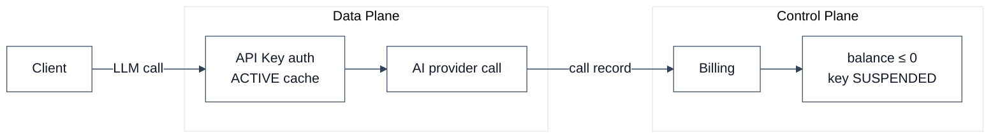
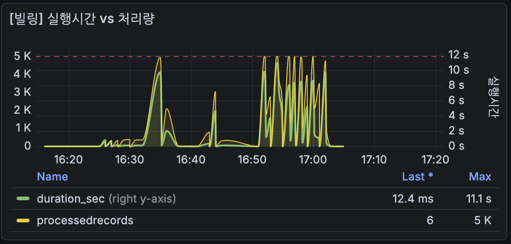
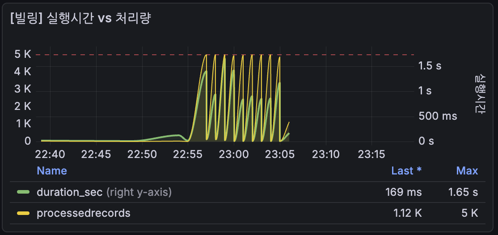

## Issue

The existing cost-control logic was intentionally designed to be lightweight.

- The Data Plane calls AI providers based on locally cached API Keys and forwards the results
- The Control Plane processes billing from call results and suspends the API Key when the balance goes negative
- During this time, the cached API Key in the Data Plane is not updated, so a gap exists for the duration of the TTL, causing a potential **billing leak**

Meanwhile, internal traffic spiked and traffic grew with self-hosted model serving, drawing traffic beyond throughput capacity — exposing the limits of the cost-control design.

## Analysis

| Approach considered | Effect | Cost |
|---|---|---|
| Pre-request budget reservation | Prevents negative balances at the source | (High) CP DB lookup per request → severe throughput drop |
| Immediate evict on key SUSPENDED | Removes cache gap | (Med) CP→multi-DP fan-out, added complexity |
| ✅ Rate Limit 1 | Per-request billing cap | (Low) Simple to implement, coarse control |
| Rate Limit 2 | Token-usage-based billing cap | (High) High implementation complexity, low priority for internal/solo-founder customers |
| ✅ Allow negative balance | Maintains throughput, structurally simple | (Low) Billing leak occurs, but a commonly adopted trade-off in high-throughput gateways, treated as an acceptable loss |
| ✅ Batch throughput expansion | Shrinks batch interval | (Med) Increased batch load |
| ✅ Shorter cache TTL | Shrinks cache gap | (Med) Higher API Key lookup volume, but proportional to distinct active keys per minute — verified proportional to distinct active keys — confirmed manageable |

Initially, the service had a limited audience, so the cost-control level was low — but as platform stability was proven and needs like self-hosted model serving emerged, the target was raised significantly to 1.5M RPM.  
Therefore, we addressed this issue with minimal development and monitoring improvements, and quickly moved into the architecture redesign.

## Improvement

With minimal additional development and configuration changes, we verified through measurement that the system handles up to 15,000 RPM without issues, securing stability and moving quickly to the next phase.

### Phase 1: batch throughput expansion

| Metric | Before | After |
|---|---|---|
| Chunk size | 1,000 | 5,000 |
| Batch count | 1 | 3 |
| Records per run | 1,000 | 15,000 |

However, post-deployment testing revealed that per-chunk processing time was too slow. (5,000 records, 11s)

### Phase 2: billing batch query improvement

| Metric | Before | After |
|---|---|---|
| Query pattern | Multiple row-level UPDATEs | `UPDATE ... FROM (VALUES ...)` single query |
| 5,000-record processing time | 11s | 1.65s |

### Phase 3: pagination chunk parallel processing — unnecessary at current level, intentionally not pursued

Switching the chunks processed in Phase 2 to parallel would further reduce processing time.  
But 5,000-record processing at 1.65s with batch 1min interval + 3 parallel batches was already sufficient to handle 15,000 RPM, so we held off to move quickly to the next architecture.