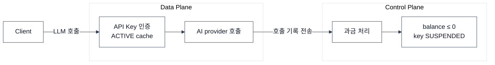

## 이슈 상황

기 구현된 비용 제어 로직은 의도적으로 단순하게 설계되었습니다.

- Data Plane은 로컬 cache된 API Key로 AI provider를 호출하고 결과를 반환합니다
- Control Plane은 호출 결과로 과금 처리를 하고, balance가 0 이하가 되면 API Key를 `SUSPENDED` 합니다
- 이때 Data Plane에 cache된 API Key는 상태가 갱신되지 않아 TTL 동안 시차가 발생해 **과금 누수**가 발생할 수 있었습니다

이런 문제가 있는 와중에 사내 트래픽이 집중되고, 자체 모델 서빙으로 유입이 늘면서 처리량을 초과하는 트래픽이 유입되 비용 제어의 한계가 드러났습니다.

## 분석

| 고려한 방식 | 효과 | 비용 |
|---|---|---|
| 요청 전 budget reservation | 마이너스 잔액 원천 차단 | (상) 매 요청마다 CP DB 조회 → 처리량 급감 |
| key SUSPENDED 시 즉시 evict | cache 시차 제거 | (중) CP→다중 DP fan-out, 복잡도 증가 |
| ✅ Rate Limit 1 | 요청 단위 과금 제한 | (하) 구현 단순, 정밀 제어 어려움 |
| Rate Limit 2 | 토큰 사용량 기반 과금 제한 | (상) 구현 복잡도 높음, 내부용·솔로 파운더 대상이라 우선순위 낮음 |
| ✅ 마이너스 잔액 허용 | 처리량 유지, 구조 단순 | (하) 과금 누수 발생하지만, 고처리량 게이트웨이에서 흔히 채택되는 절충안이며 허용 손실로 정의 |
| ✅ batch 처리량 확대 | batch 주기 축소 | (중) batch 부하 증가 |
| ✅ cache TTL 단축 | cache 시차 축소 | (중) API Key 조회량 증가하지만, 분당 고유 active key 수에 비례하므로 측정 후 수용 가능 |

초기에는 대상이 제한된 서비스였기에 비용 제어의 수준이 낮았지만, 플랫폼 안정성이 검증되고 자체 모델 서빙 등의 니즈가 들어오면서 목표가 150만 RPM으로 크게 상향되었습니다.  
따라서 이번 이슈는 최소한의 개발과 모니터링 확충으로 정리하고, 아키텍처 재설계에 빠르게 들어가기로 했습니다.

## 개선

최소의 추가 개발과 설정 수정만으로도 15,000 RPM까지 문제 없음을 실측으로 확인하고, 빠르게 다음 단계로 넘어갈 수 있었습니다.

### Phase 1: batch 처리량 확대

| 항목 | Before | After |
|---|---|---|
| chunk size | 1,000 | 5,000 |
| batch count | 1 | 3 |
| 처리량 | 1,000건 | 15,000건 |

하지만 적용 후 테스트 과정에서 청크당 처리 시간이 너무 오래 걸리는 것을 발견했습니다. (5,000건, 11초)

### Phase 2: 과금 배치 쿼리 개선

| 항목 | Before | After |
|---|---|---|
| 쿼리 형태 | row 단위 다중 UPDATE | `UPDATE ... FROM (VALUES ...)` 단일 쿼리 |
| 5,000건 처리 시간 | 11초 | 1.65초 |

### Phase 3: 페이지네이션 청크 병렬 처리 — 현재 수준에서 불필요하여 의도적 미진행

Phase 2에서 처리하는 청크를 병렬로 전환하면 처리 시간을 더 낮출 수 있습니다.  
하지만 5,000건 처리 1.65초, batch 1분 주기 + 병렬 3배치로 15,000 RPM을 이미 수용 가능했고, 빠르게 다음 아키텍처로 넘어가기 위해 보류하였습니다.