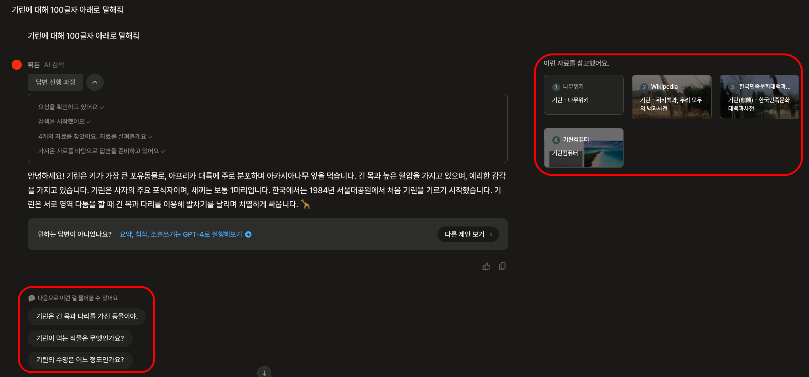
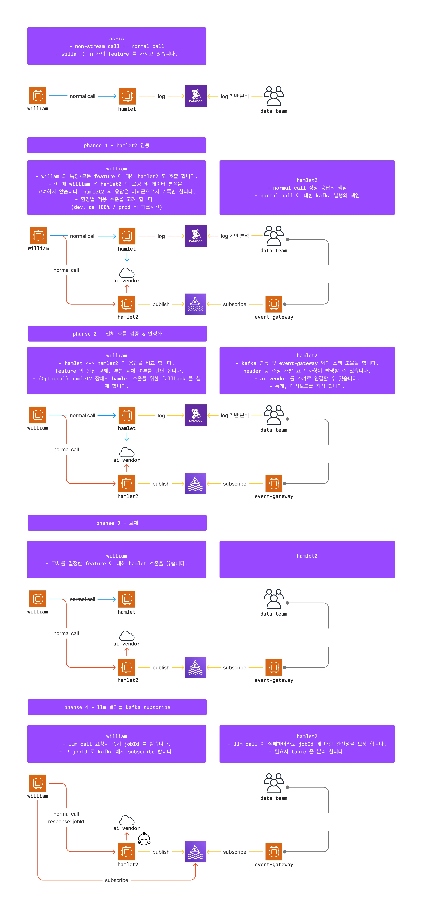
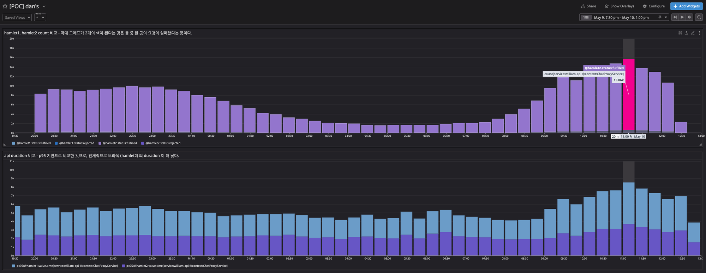
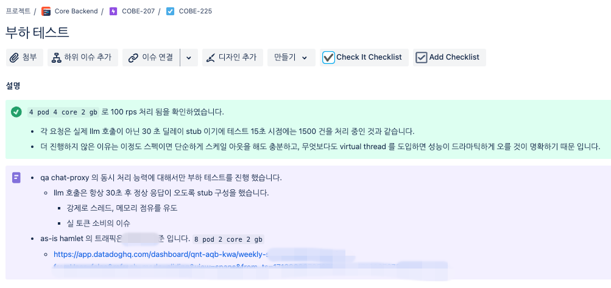
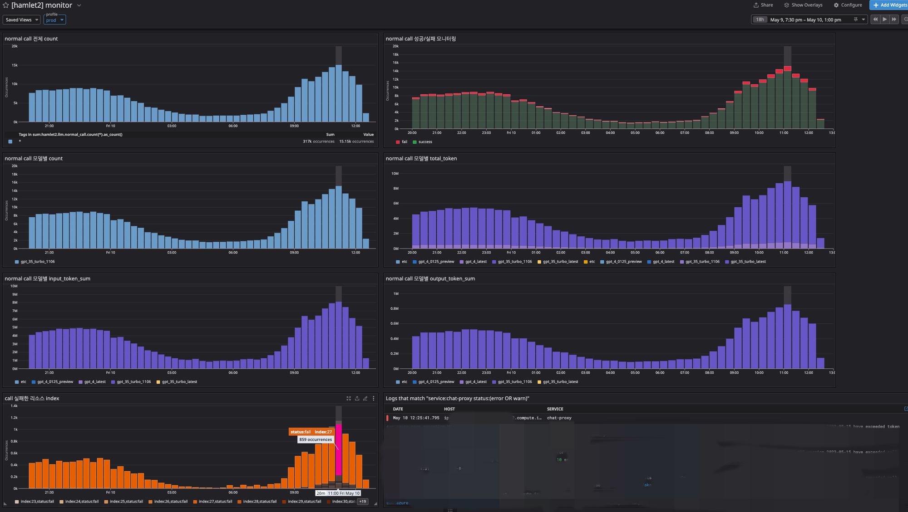
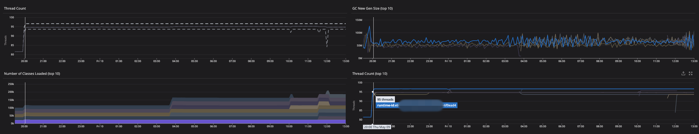

## Background

The existing Node-based `hamlet1`, operated as a monolith, was highly complex and could be maintained by only one person.  
A zero-downtime replacement was a hard requirement, and a design for long-term evolution was also needed.

## Outcomes

- Resolved `hamlet1`'s high complexity and single-operator problem, securing operational ease by splitting it out into the JVM-based `hamlet2`
- Designed a Spring AI based provider / model extension structure, laying the foundation for long-term scaling such as serving 27 PTUs worldwide
- Served related links and dynamic chips on Wrtn's main screen, with RPM 750 and a 20% improvement in API response time
- Reduced errors and enabled proactive detection through improved retry logic and observability

*Screenshot of the related links and dynamic chips served live on Wrtn's main screen.*

## Details

**Service Rollout Plan**  
Aligned target features, architecture, and migration schedule with stakeholder teams, proceeding phase by phase from development through production.

*Phased rollout plan aligning features, architecture, and migration schedule across teams.*

**Hamlet1 / Hamlet2 Comparison**  
During peak hours it handled 15,000 requests per 20 minutes, around RPM 750, with a 20% improvement in duration.

*Peak-hour metrics comparing hamlet1 and hamlet2: ~RPM 750 with 20% faster duration.*

**Pre-launch Load Testing**  
Using Gatling-based load testing, I verified the target throughput and infrastructure specs in advance.

<figure class="grid-cap">

*Gatling load test results verifying target throughput before launch.*

</figure>

<figure class="grid-cap">

*Additional Gatling load test results confirming required infrastructure specs.*

</figure>

**Observability Improvements**  
I configured a new dashboard to surface AI model call failures and infrastructure load.

*New dashboard surfacing AI model call failures for proactive detection.*

<figure class="grid-cap">

*Dashboard panel monitoring infrastructure load metrics.*

</figure>

<figure class="grid-cap">

*Additional infrastructure load monitoring panel.*

</figure>

<figure class="grid-cap">

*Further infrastructure load monitoring panel on the dashboard.*

</figure>

**Zero-downtime Migration**  
By splitting the cutover between the existing and new services, I replaced the live service features with zero downtime.

*Cutover-complete notice with metrics confirming the zero-downtime switch from william to hamlet2.*
