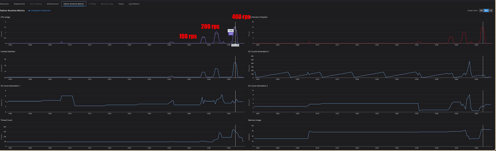

## Background

GPT-4o uses a different encoding scheme from previous models, which introduced errors in the existing token-counting logic.

- Token counting is directly tied to cost estimation and usage control, so a fast response was required
- Since OpenAI's official token-counting library was provided in Python, rather than forcing it into the Kotlin/JVM services, I separated it out as a distinct feature within CDS

*Diagram showing why the Python token-counting library was isolated within CDS.*

## Outcomes

- Internal services could now reliably use the calculation logic needed for AI cost optimization and pre-emptive usage validation
- Through pre-launch load testing, I verified request handling at around RPS 400 and the corresponding infrastructure specs

## Details

- Used OpenAI's official Tiktokenizer library to provide per-model token counting

*Load test summary confirming request handling at around RPS 400.*

*Load test result verifying tokenizer throughput before launch.*

*Additional load test result confirming corresponding infrastructure specs.*

